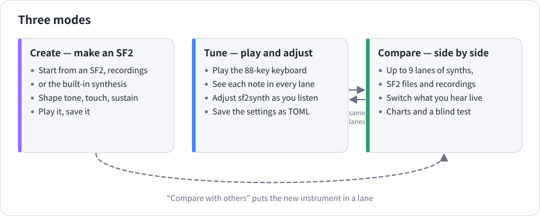

# sf2studio guide

sf2studio makes, tunes and compares SF2 instruments. It plays them with
[sf2synth](https://github.com/albos-inc/sf2synth) (and, on macOS, with the
system's own sampler), draws what you hear, and lets you switch between
instruments while the music plays.

## Pages

| Page | What is in it |
|---|---|
| [Getting started](getting-started.md) | The window, the top bar, menus, the first launch and what is remembered |
| [Compare](compare.md) | Lanes, the “Play” content, switching what you hear, matching levels, measurement charts, the blind test |
| [Tune](tune.md) | The keyboard, rendering a single note in every lane, every sf2synth setting, saving settings as TOML |
| [Create](create.md) | Making an SF2 from an SF2, recordings or synthesis; every shaping setting; saving and comparing |
| [Reading the display](reading-the-display.md) | Spectrogram, level line, waveform close-up, piano roll, harmonics, the keyboard's marks and the charts |
| [Recipes](recipes.md) | Step-by-step: “I want to …” |
| [Reference](reference.md) | Keys, mouse, command line, files, what is saved, troubleshooting, glossary |

## Where to start

- **Hear the difference between two instruments** → [Recipe 1](recipes.md#1-compare-two-sf2-files)
- **Check how an SF2 responds to soft and hard playing** → [Recipe 5](recipes.md#5-see-how-loudness-and-brightness-follow-velocity)
- **Make your own piano SF2** → [Recipe 9](recipes.md#9-make-a-brighter-longer-version-of-an-sf2-piano)
- **Find out whether you can really hear a difference** → [Recipe 4](recipes.md#4-find-out-whether-you-can-really-hear-a-difference)

## The window at a glance

1. **Mode switch** — Create, Tune and Compare.
2. **Language, theme and Help.**
3. **Left panel** — what is played and the lanes that play it.
4. **Show** — which views the timeline draws.
5. **Measurement charts** (Compare only).
6. **Timeline** — every lane's spectrogram and level, the piano roll above, a waveform close-up below.
7. **Transport** — play, position, which lanes you hear, level matching and the output meter.

In the app, **Help → How to use** gives a short summary and opens these pages.
