# Compare

[Guide](README.md) › Compare

Compare puts up to nine **lanes** side by side. Each lane plays the same
music through a different synthesizer, instrument file or recording. You
see every lane at once, and while the music plays you choose which lanes
you hear — the switch is sample-aligned, level-matched and click-free, so
what changes is only the sound.

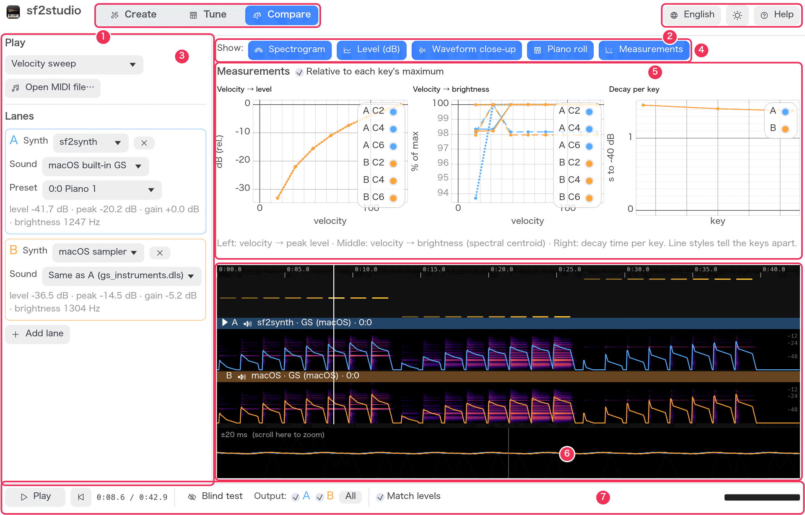

## What is played

**① What to play.** The menu lists five test patterns, each made to probe
one aspect of an instrument. Every lane plays the same thing.

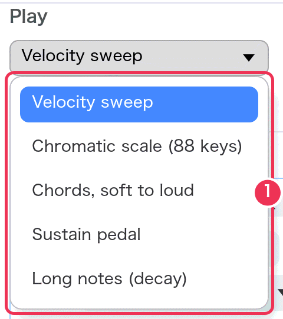

| Test pattern | What it plays | Use it to see |
|---|---|---|
| Velocity sweep | C4, then C2 and C6, each at velocities 16, 32 … 127 (8 steps, 1.2 s each) | how loudness and brightness follow velocity; the [velocity charts](#measurement-charts) |
| Chromatic scale (88 keys) | every key from A0 to C8 at velocity 80, 0.25 s each | uneven notes, sample boundaries, tuning across the range |
| Chords, soft to loud | four-note C major chords from C2 to C6, velocity 30 → 127 | how the instrument blends and fills up |
| Sustain pedal | three arpeggios with the pedal held, the pedal released, then the same without the pedal | pedal resonance and how notes stop |
| Long notes (decay) | C1 to C7, one per octave, held 6 s at velocity 96 | decay and release; the [decay chart](#measurement-charts) |

**② Open MIDI file…** plays a Standard MIDI File (`.mid`, `.midi`, `.kar`,
`.rmi`) instead. The lane's preset is selected on every channel except the
drum channel (10), but program changes inside the file still apply.

After a note is played on the keyboard in [Tune](tune.md), this menu shows
that note (for example `C4 · vel 96 · 1.50 s`), because the lanes then play
just that note. Choose a pattern to go back.

Changing what is played puts the playhead at the start, clears the loop and
renders every lane again.

## Lanes

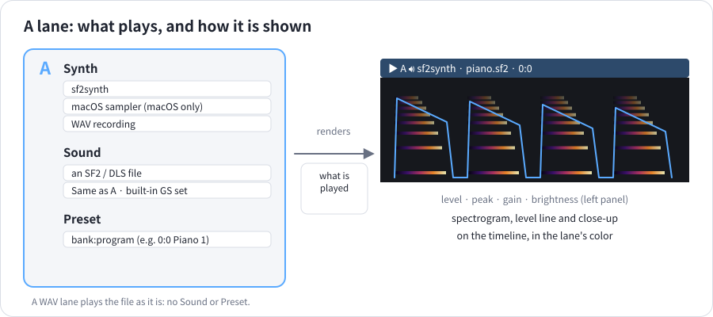

A lane is a **synth**, the **sound** it plays and a **preset** in it — or a
recording. Lanes are named A to I and keep their color everywhere: in the
left panel, on the timeline, in the charts and in the transport.

| In the panel | What it does |
|---|---|
| **③ Synth** | **sf2synth** — the synthesizer this app is built on. **macOS sampler** — Apple's AVAudioUnitSampler, what most iOS and macOS apps play SF2 files with (macOS only). **WAV recording** — a sound file played as it is. |
| **④ Sound** | The instrument file: **Choose a file (SF2 / DLS)…**, the **built-in GS set** of macOS or Windows, or — for lanes B to I — **Same as A**. |
| **⑤ Preset** | Which instrument in the file, as `bank:program name`. For the macOS sampler the list is the 128 General MIDI names plus Drums (128:0). Hidden when the lane plays the same as A. |
| **⑥ Lane figures** | **level** (average level of the sounding parts) · **peak** · **gain** (the level-matching correction) · **brightness** (the typical spectral centroid: higher = brighter). “Rendering…” while the lane is being made; an error in red if the file can't be played. |
| **⑦ ×** | Removes the lane (there is always at least one). |
| **⑧ Same as A** | The lane follows lane A's file and preset: change A and it changes too. Handy for comparing synthesizers on one file. |
| **⑨ Add lane** | Adds a lane (up to nine) playing the same as A. |

<table><tr>
<td valign="top">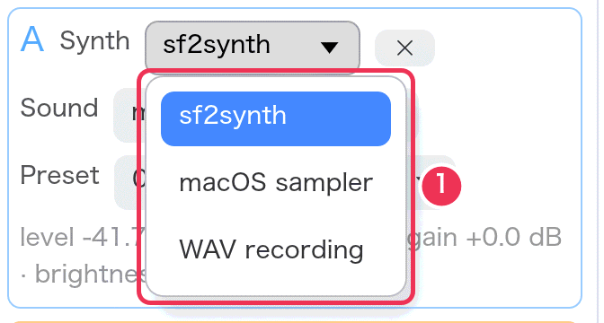</td>
<td valign="top">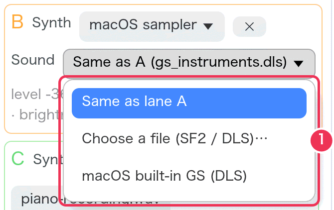</td>
</tr></table>

A WAV lane shows one **Choose a WAV…** button instead of Sound and Preset.
The recording is played as it is, from its start, whatever the “Play”
content — so record the same MIDI file you play in the other lanes (see
[Recipe 3](recipes.md#3-compare-a-recording-with-an-sf2)).

Each lane is rendered in the background when something about it changes;
the others keep playing.

## The transport

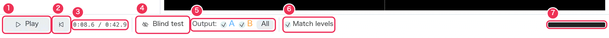

1. **Play / Pause** (Space).
2. **To the start** (Home).
3. **Position / length** in minutes:seconds.
4. **Blind test** — opens the [ABX test](#the-blind-test).
5. **Output** — which lanes you hear. Click a lane's box (or press 1–9) to
   turn it on or off while playing; **Shift**-click (or Shift+1–9) hears only
   that lane; **All** turns every lane on. **Tab** hears the next lane alone.
6. **Match levels** — see below.
7. **Output meter** — green; red when the output clips.

While a loop is set, the transport also shows its range with an × to clear
it. Keyboard hints appear on the right when there is room.

### Hearing one lane at a time

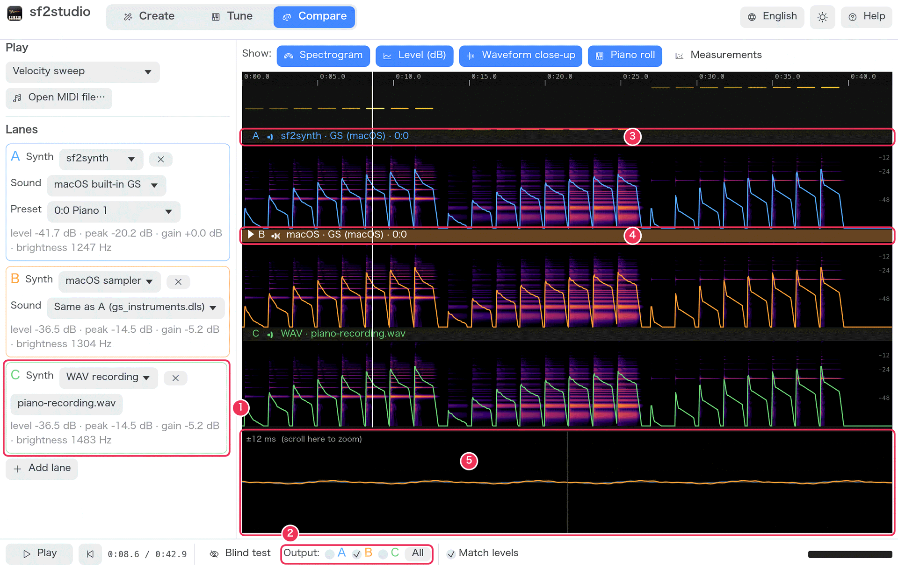

1. A third lane, here a **WAV recording**.
2. Only **B** is checked under Output.
3. Lane A's header is grey and its speaker quiet: it isn't heard.
4. Lane B's header is filled with its color; ▶ marks the lane last chosen.
5. In the close-up the heard lanes are drawn bright and on top; the others faint.

### Match levels

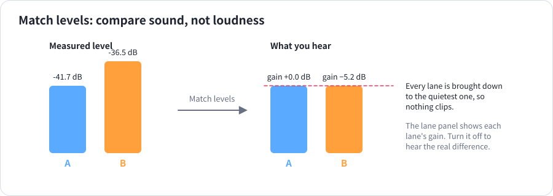

Two instruments at different loudness are hard to compare: the louder one
usually sounds “better”. With **Match levels** on, every lane is turned down
to the quietest one, measured over the parts that sound. The correction is
shown as **gain** in each lane's figures. The timeline is drawn matched too
(to the loudest, so the pictures stay bright). Turn it off to hear the real
difference in level.

## Show

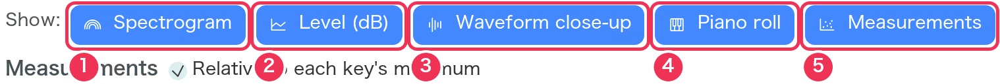

Turn views on and off to give the others more room:

1. **Spectrogram** — the colors in each lane.
2. **Level (dB)** — the line over it.
3. **Waveform close-up** — the strip at the bottom.
4. **Piano roll** — the notes played, above the lanes.
5. **Measurements** — the charts (Compare only).

What each view shows: [Reading the display](reading-the-display.md).

## Measurement charts

The charts measure every note of the “Play” content that sounds on its own
(no other note within 0.3 s), lane by lane. They appear when the content
has something to measure — choose **Velocity sweep**, **Long notes** or
**Chromatic scale**.

1. **Relative to each key's maximum** — on: each key's levels are shown
   below its loudest note and its brightness as a percentage of its
   brightest, so keys and lanes of different loudness line up. Off: absolute
   dB and Hz.
2. **Velocity → level** — the peak level of each velocity, one line per lane
   and key (the line style tells the keys apart). A steep line: a big
   difference between soft and loud.
3. **Velocity → brightness** — the spectral centroid just after the attack.
   A rising line: harder playing sounds brighter, as on a real piano.
4. **Decay per key** — seconds until each note is 40 dB below its peak,
   across the keyboard. Higher: longer sustain.

More on reading them: [Reading the display](reading-the-display.md#measurement-charts).

## The timeline

Click to move the playhead, drag to scrub. **Shift-drag** sets a loop;
**L** clears it. Clicking a note in the piano roll loops that note and plays
it. Clicking a lane's header selects it (▶). Pinch or Ctrl-scroll zooms,
scrolling pans, double-click shows everything again. Details:
[Reading the display](reading-the-display.md).

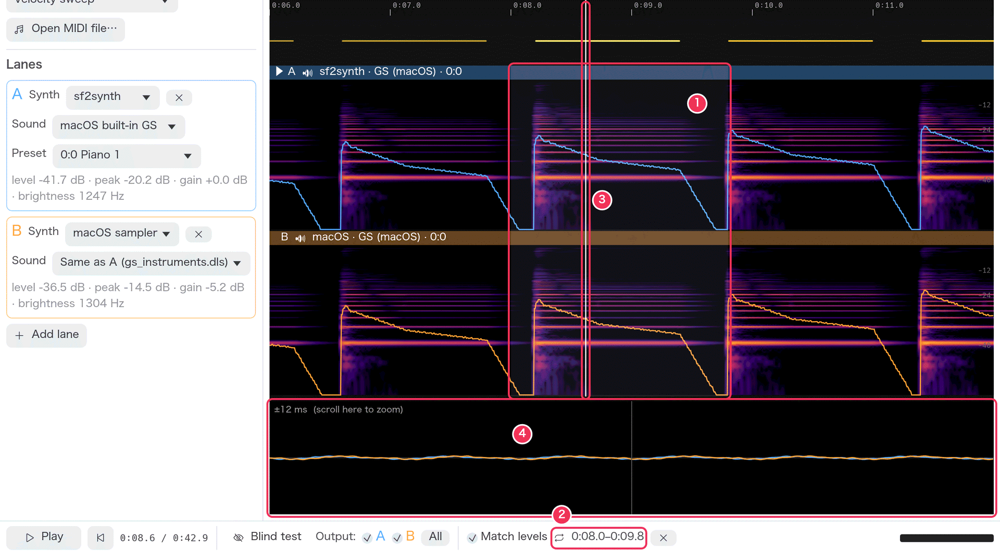

1. The loop (shaded); playback repeats it.
2. The loop's range in the transport; × clears it.
3. The playhead.
4. The waveform close-up around the playhead.

## The blind test

Can you really hear the difference, or do you only think so? The ABX test
answers that.

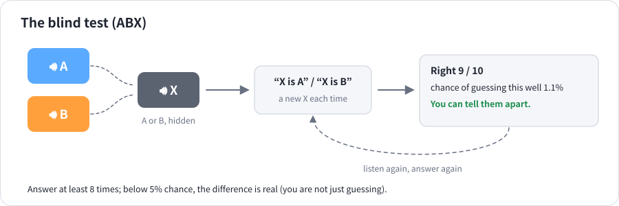

Turn on **Blind test** in the transport. From then on the lanes you hear are
hidden: the Output boxes, the lanes' speakers and the key shortcuts are
off until you close the test.

1. **Compare lanes** — the two lanes to test (A and B by default).
2. **🔊 A, 🔊 B, 🔊 X** — each plays the music through that lane. X is A or
   B, chosen at random. Listen as often as you like.
3. **X is A / X is B** — your answer. A new X is chosen for the next round.
4. Whether the answer was right.
5. Right answers so far, and the **chance** of doing that well by guessing.
6. The verdict, after 8 answers: under 5% chance means you can tell them apart.
7. **Start over** clears the score.

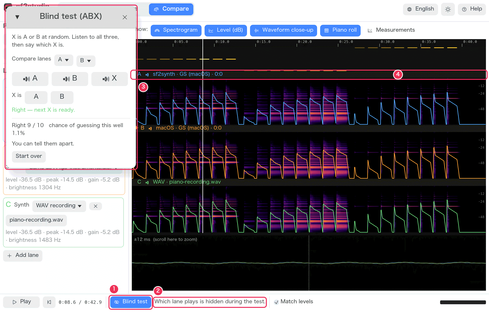

1. **Blind test** is on.
2. The transport says which lane plays is hidden.
3. The test window.
4. No lane header shows which one is heard.

Tip: set a short loop first (Shift-drag over a few notes) so that A, B and
X play the same passage.
