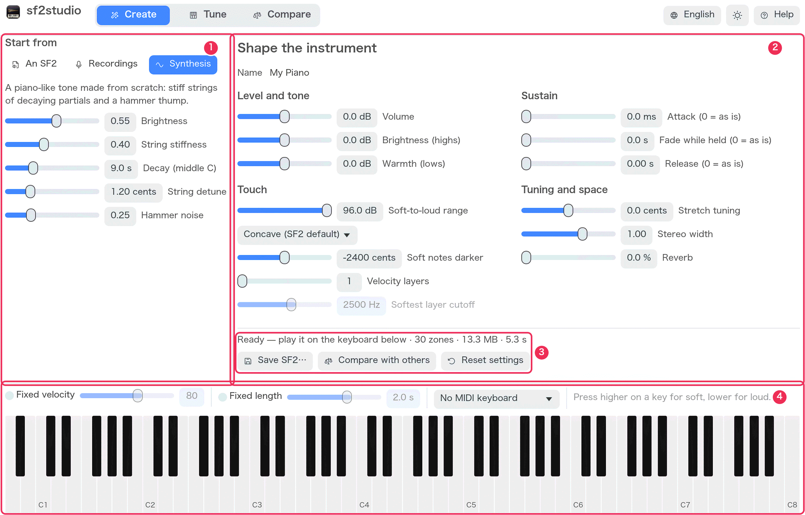
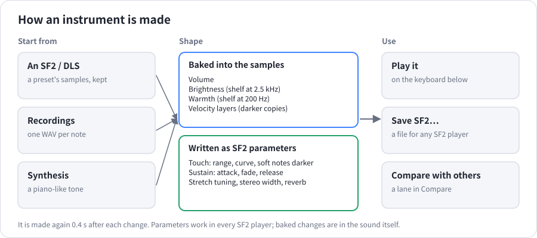
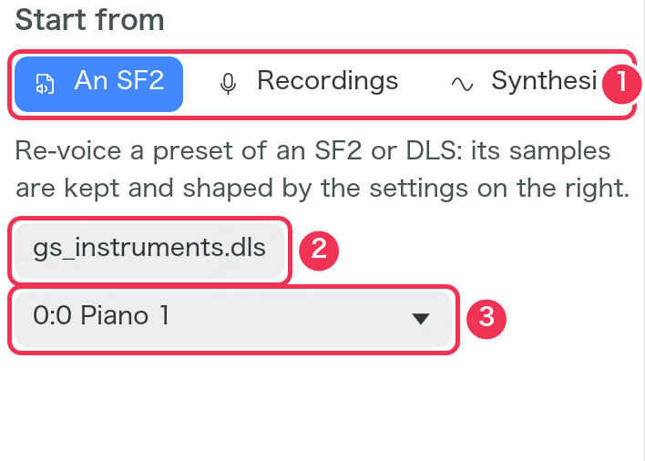
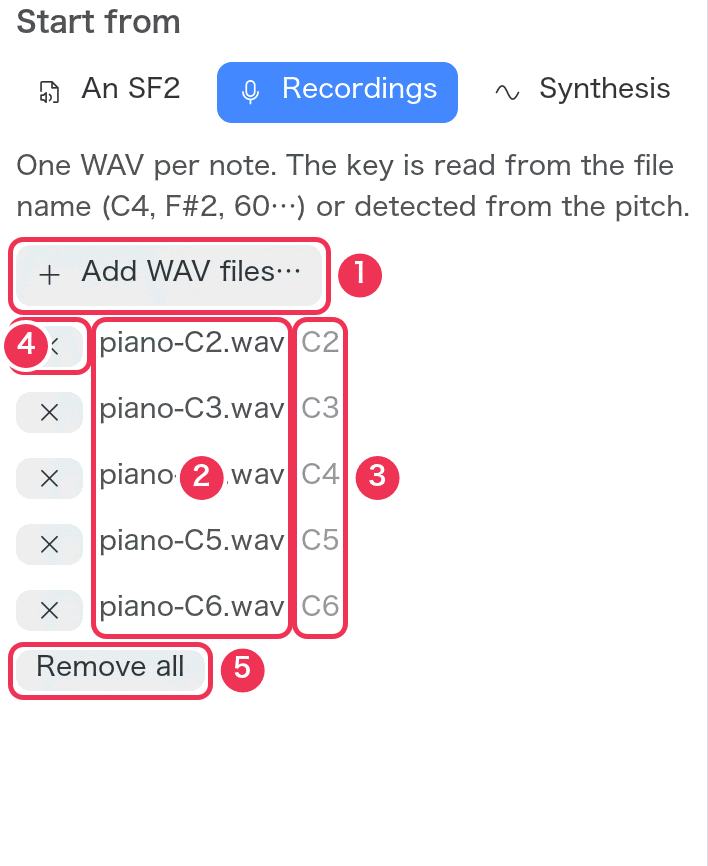
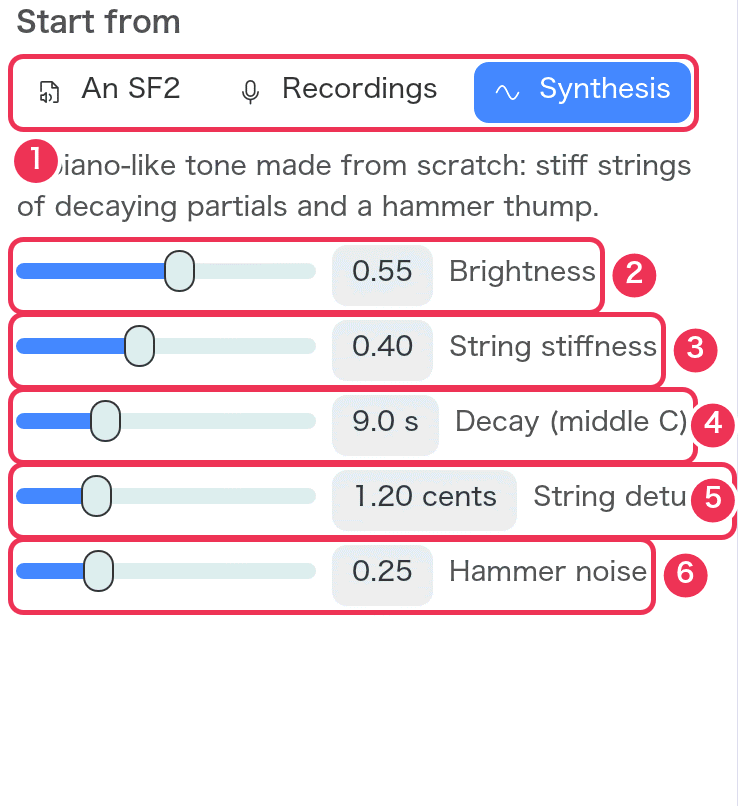
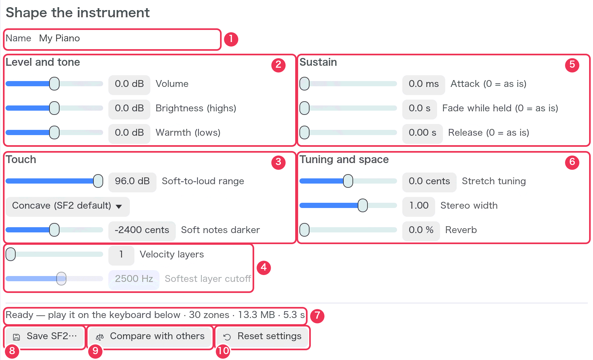
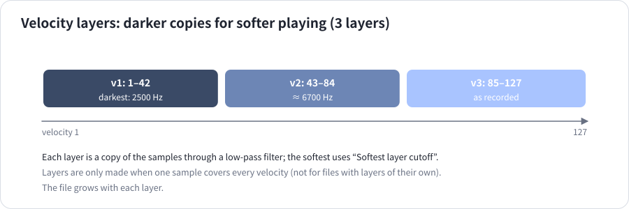
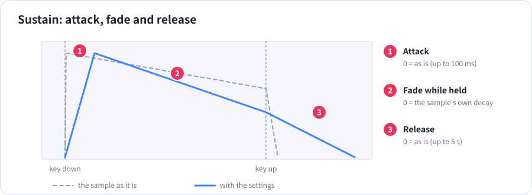
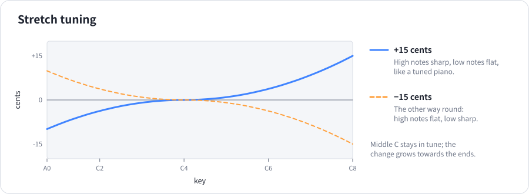
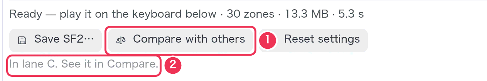

# Create

[Guide](README.md) › Create

Create makes a new SF2 instrument. Choose what it starts from, shape how it
should sound, and play it on the keyboard as you go — it is made again a
moment after every change. When you like it, save it as an SF2 file or send
it to Compare to hear it next to other instruments.

1. **Start from** — the material: an existing SF2, recordings, or synthesis.
2. **Shape the instrument** — level and tone, touch, sustain, tuning and space.
3. **Status and actions** — save, compare, reset.
4. **Keyboard** — play the instrument being made (as in [Tune](tune.md#the-keyboard), without rendering lanes).

## Start from

### An SF2

1. Choose **An SF2**.
2. **Choose an SF2 or DLS…** — the file to start from. DLS files (such as the
   systems' built-in GS sets) work too.
3. The **preset** to re-voice.

The preset's samples, key and velocity ranges and its own settings are kept;
the settings in the centre are applied on top.

### Recordings

One WAV file per note — for example a piano you recorded, key by key.

1. **Add WAV files…** — choose one or more WAV files (more can be added later).
2. The files in use.
3. The key read from each file's name.
4. **×** removes one file.
5. **Remove all**.

- **The key** comes from the file name: `C4`, `F#2`, `Bb5`, `Cs3` (C♯3), or
  a MIDI number such as `piano_060` (C4 = 60). Other words in the name are
  ignored, so `Steinway C4 loud.wav` works.
- Without a key in the name, the pitch is **detected** (25 Hz–4.5 kHz). A
  recording slightly off pitch is corrected by up to ±50 cents.
- Each recording plays from just before its sound starts (silence at the
  start is cut), in mono, until it ends — record notes as long as you want
  them to ring. A silent file, or one with no name and no clear pitch, gives
  an error.
- Each recording covers the keys halfway to its neighbours; the lowest and
  highest reach the ends of the keyboard.

### Synthesis

A piano-like tone made from scratch — no files needed. Every third key is
synthesized: three slightly detuned strings of decaying partials plus a
hammer thump.

| # | Setting | Range (default) | What changes |
|---|---|---|---|
| 1 | (choose **Synthesis**) | | |
| 2 | **Brightness** | 0–1 (0.55) | How strong the upper partials are: dull to bright. |
| 3 | **String stiffness** | 0–1 (0.40) | Partials pulled sharp, as in real piano strings (more in the treble). 0: perfectly harmonic, a little electric. |
| 4 | **Decay (middle C)** | 1–30 s (9 s) | How long middle C takes to fade by 60 dB. Higher notes fade faster. |
| 5 | **String detune** | 0–5 cents (1.2) | The strings of a note slightly apart: slow beating, a chorus-like warmth. |
| 6 | **Hammer noise** | 0–1 (0.25) | The thump at the start of each note. |

## Shape the instrument

Every change makes the instrument again after 0.4 s. Two kinds of settings:
**baked** ones change the samples themselves; **parameter** ones are written
into the SF2, so every SF2 player follows them.

**① Name** — the instrument's name inside the SF2, and the file name
offered when saving.

### Level and tone (baked)

② in the screenshot.

| Setting | Range (default) | What changes |
|---|---|---|
| **Volume** | ±12 dB (0) | The samples' level. Use it to match other instruments; avoid making it so loud the output meter turns red. |
| **Brightness (highs)** | ±12 dB (0) | Treble above about 2.5 kHz: crisper (+) or softer (−). |
| **Warmth (lows)** | ±12 dB (0) | Bass below about 200 Hz: fuller (+) or leaner (−). |

### Touch (parameters, layers baked)

③ and ④ in the screenshot.

| Setting | Range (default) | What changes |
|---|---|---|
| **Soft-to-loud range** | 0–96 dB (96) | How much quieter velocity 1 is than 127. Lower: an even, compressed feel. |
| **Curve** | Concave (SF2 default), Linear, Convex | How loudness rises with velocity — see [the chart](tune.md#sf2synth-settings). |
| **Soft notes darker** | −4800 to 0 cents (−2400) | Filters soft notes more than loud ones. 0: the same tone at every velocity. |
| **Velocity layers** (④) | 1–4 (1) | Makes darker copies of the samples for softer velocities, for a more natural change of tone. |
| **Softest layer cutoff** | 500–8000 Hz (2500) | How dark the softest layer is (only with 2 or more layers). |

### Sustain (parameters)

⑤ in the screenshot.

| Setting | Range (default) | What changes |
|---|---|---|
| **Attack** | 0–100 ms (0 = as is) | A slower start: softens the strike. |
| **Fade while held** | 0–30 s (0 = as is) | How long a held note takes to fade to silence. 0 keeps the samples' own decay. |
| **Release** | 0–5 s (0 = as is) | How long a note rings on after the key is released. |

### Tuning and space (parameters)

⑥ in the screenshot.

| Setting | Range (default) | What changes |
|---|---|---|
| **Stretch tuning** | ±30 cents (0) | Treble sharp and bass flat (+), as pianos are tuned, or the other way (−). Middle C stays put; the full amount is reached four octaves away. |
| **Stereo width** | 0–1.5 (1.00) | Scales the source's left–right placement of its notes: 0 mono, 1 as it is, above 1 wider. Only an SF2 source has a placement to scale; recordings and synthesis are centred. |
| **Reverb** | 0–100 % (0) | How much of the instrument goes to the player's reverb. |

### Status and actions

7. **Status** — a progress bar while it is being made; then
   `Ready — play it on the keyboard below · 30 zones · 13.3 MB · 5.6 s`:
   zones (sample regions), the file size and how long making it took. Errors
   appear in red.
8. **Save SF2…** — writes the instrument as an SF2 file.
9. **Compare with others** — adds a lane playing this instrument (or updates
   the one added before). From then on the lane is updated every time the
   instrument is made again, so Compare always has the latest version.
10. **Reset settings** — every shaping setting back to its default (the name
    is kept).

The keyboard plays the instrument with sf2synth's default settings.

## Sending it to Compare

1. **Compare with others**.
2. The lane it went into.

1. Lane C plays the new instrument (`My_Piano.sf2`, a working copy in the
   system's temporary folder — use **Save SF2…** to keep it).
2. Its lane on the timeline, next to the instruments it was made from.

## Next

- [Recipe 9: a brighter, longer version of an SF2 piano](recipes.md#9-make-a-brighter-longer-version-of-an-sf2-piano)
- [Recipe 10: an SF2 from your recordings](recipes.md#10-make-an-sf2-from-recordings)
- [Recipe 11: a piano SF2 with no files at all](recipes.md#11-make-a-piano-sf2-without-any-files)
