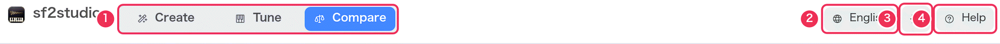
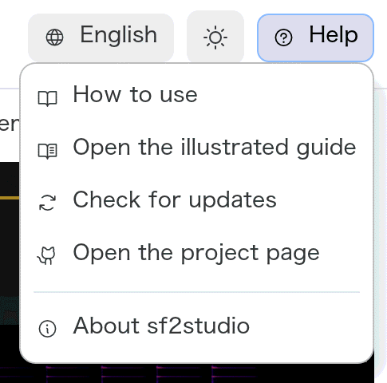
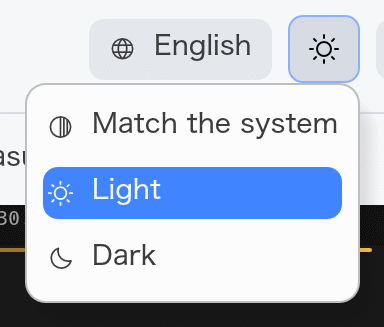
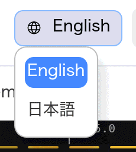
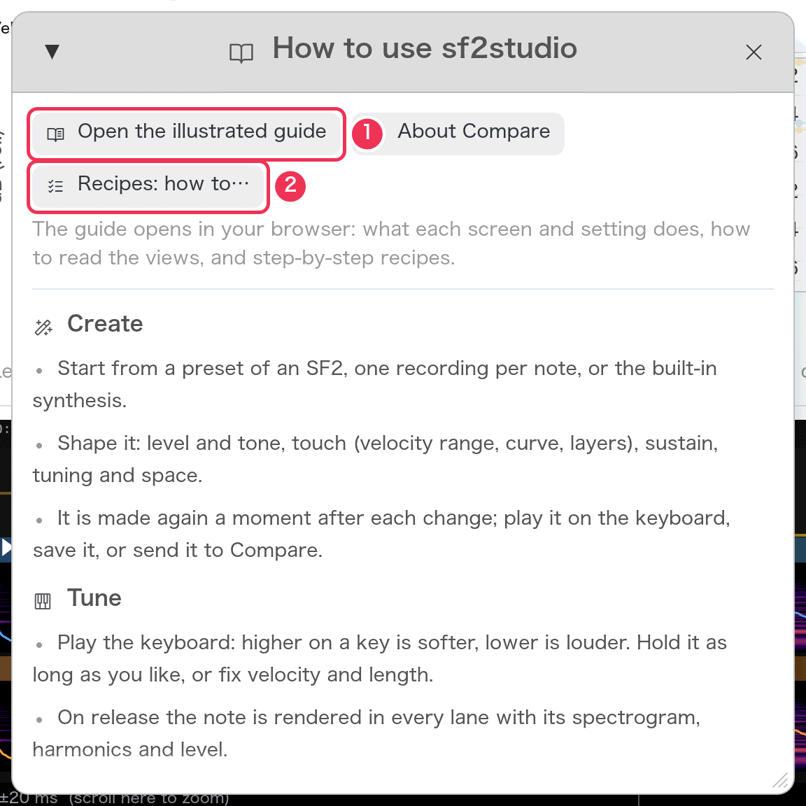

# Getting started

[Guide](README.md) › Getting started

## Run it

sf2studio runs on macOS and Windows. From the source:

```sh
cargo run --release
```

## The first launch

sf2studio opens in **Compare** with a setup that sounds straight away:

| | macOS | Windows |
|---|---|---|
| Lane A | sf2synth playing the system's built-in GS set (DLS) | sf2synth playing Windows's GS set (`gm.dls`) |
| Lane B | the macOS sampler playing the same instruments | a WAV lane — choose a recording |
| Play | the velocity-sweep test pattern | the same |

So on macOS you can press **Space** at once and hear sf2synth and Apple's
sampler play the same piano, one after the other or side by side. The
language follows the system (English or Japanese).

## The window

Every mode shares the top bar. Below it the window changes with the mode:

| | Create | Tune | Compare |
|---|---|---|---|
| Left panel | what the instrument starts from | “Play” and the lanes | “Play” and the lanes |
| Centre | the shaping settings | the timeline | measurement charts and the timeline |
| Right panel | — | sf2synth settings of the lane you hear | — |
| Bottom | the keyboard | the keyboard and the transport | the transport |

The panels' edges can be dragged to make them wider or narrower, and the
keyboard taller or shorter.


## The top bar



1. **Mode switch** — **Create** makes an SF2, **Tune** plays and adjusts one
   lane from the keyboard, **Compare** puts lanes side by side. The lanes and
   what is played are shared by Tune and Compare, so you can move between
   them freely.
2. **Language** — English or 日本語. Takes effect at once.
3. **Theme** — Match the system, Light or Dark. The timeline is always dark
   so the spectrogram reads the same in both.
4. **Help** — the menu below.

If the audio output can't be opened, a red speaker icon and the reason
appear to the left of the language menu; the views still work.

<table><tr>
<td valign="top"></td>
<td valign="top"><br></td>
</tr></table>

| Help menu item | What it does |
|---|---|
| How to use | A short summary of the three modes and the keys, with buttons that open this guide (the whole guide, the page for the current mode, or the recipes). |
| Open the illustrated guide | Opens this guide in your browser, in the app's language. |
| Check for updates | Asks GitHub for the newest release and compares it with your version. If a newer one exists, a button opens its download page. Nothing is downloaded by itself. |
| Open the project page | Opens the GitHub repository. |
| About sf2studio | Version, license and the libraries it is built with. |



1. **Open the illustrated guide**, and next to it the page for the mode you are in.
2. **Recipes** — step-by-step instructions for common tasks.

## What is remembered

When you quit, sf2studio keeps:

- the language, theme and mode,
- what is played (test pattern, MIDI file or the last keyboard note),
- every lane: its synth, sound file, preset and sf2synth settings,
- **Match levels**, the **Show** toggles and the keyboard settings,
- in Create: what the instrument starts from and every shaping setting.

The instrument made in Create is **not** kept — save it with **Save SF2…**.
The playback position, loop and zoom start fresh.

## Next

- [Compare](compare.md) — the mode it opens in.
- [Recipes](recipes.md) — if you already know what you want to do.
