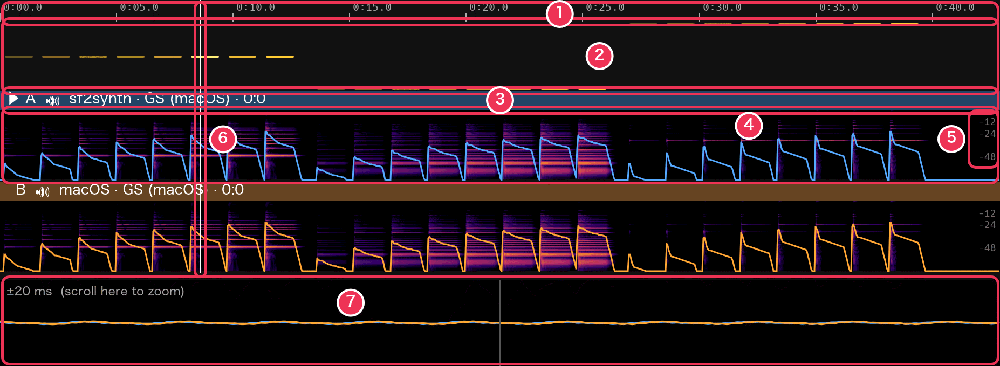
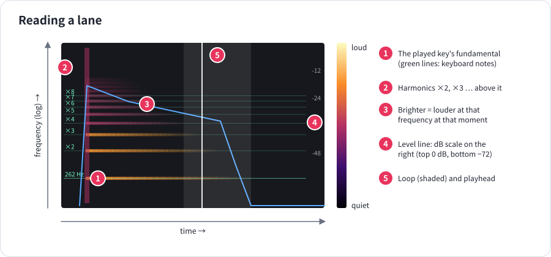
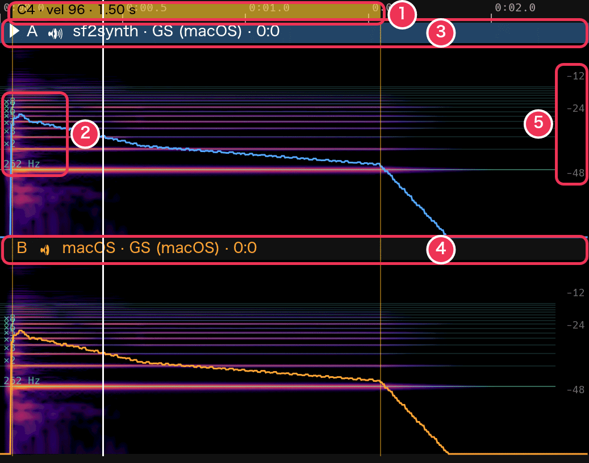
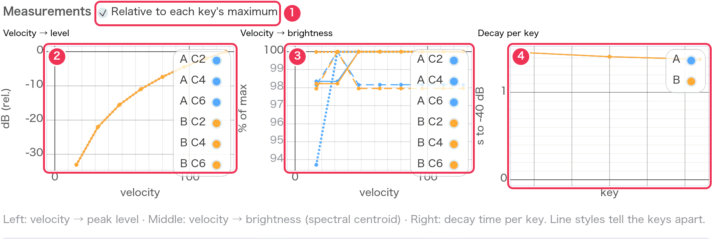
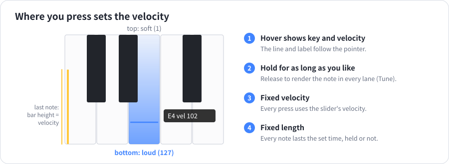

# Reading the display

[Guide](README.md) › Reading the display

Every lane is drawn from its rendering: what you see is exactly what you
hear. This page explains each part and what to look for.

## The timeline

1. **Ruler** — time in minutes:seconds. After a keyboard note it also shows
   the note as a yellow band: as long as it was held, as strong as its color.
2. **Piano roll** — the notes being played, low to high; the stronger the
   note, the brighter. Notes sounding at the playhead light up. **Click a
   note** to loop it and play it.
3. **Lane header** — ▶ marks the selected lane, then its letter, 🔊 when it
   is heard (🔈 when not), the synth, the file and the preset. The header is
   filled with the lane's color while the lane is heard. Click it to select
   the lane.
4. **Spectrogram** with the **level line** over it (below).
5. **Level scale** — −12, −24 and −48 dB for the level line.
6. **Playhead** — where playback is. Click or drag anywhere to move it.
7. **Waveform close-up** — every lane's waveform around the playhead (below).

### Moving around

| Do this | To |
|---|---|
| Click / drag | Move the playhead |
| Shift-drag | Set a loop (L or × clears it) |
| Click a piano-roll note | Loop that note and play it |
| Pinch, or Ctrl + scroll | Zoom in and out around the pointer |
| Scroll | Move along the timeline |
| Double-click | Show everything again (and follow the playhead) |

While playing, the view follows the playhead — until you zoom or scroll
yourself; double-click to follow again.

## The spectrogram and the level line

- **Across**: time. **Up**: frequency on a log scale, from 27.5 Hz (A0) at
  the bottom to 18 kHz at the top — every octave takes the same height.
- **Color**: level at that time and frequency, from black (silent) through
  purple and red to pale yellow (loud).
- **Horizontal stripes** are a note's partials. A clean piano note shows a
  ladder of stripes that fade from the top down: high partials die first.
- **A vertical smear** at a note's start is the attack — the hammer, or a
  click.
- **The level line** is the lane's level in dB (top 0 dB, bottom −72 dB): a
  sharp rise at each note, then the decay. A straight sloping line is an
  even exponential decay; a bend means the decay changes speed.

The lanes are drawn **matched to the loudest lane** when Match levels is
on, so equal colors mean equal levels across lanes.

What to compare between lanes:

| Look at | What it tells you |
|---|---|
| How high the bright stripes reach | brightness; brighter instruments reach further up |
| How fast the upper stripes fade | how quickly the tone darkens after the attack |
| The level line's slope | how fast the note decays |
| The gap after a note ends | the release; a long smear is reverb or a slow release |
| Stripes that wobble or double | detuned strings (beating), chorus |
| Noise between the stripes | hammer and string noise, reverb, or sampling artefacts |

## Harmonics of a keyboard note

After you play a key in [Tune](tune.md), green lines mark where the note's
fundamental (with its frequency, here 262 Hz) and harmonics ×2 to ×8 (and
fainter, up to ×16) should be. Partials sitting slightly above the lines,
more so higher up, are the stretch of a real piano string; stripes far from
any line are noise or a wrong sample.

## The waveform close-up

The strip at the bottom shows every lane's waveform around the playhead —
±20 ms at first. **Scroll over it** to zoom between ±1 ms and ±500 ms. Lanes
you hear are drawn bright and on top; the others faint. Use it to see phase
and shape differences, clicks, or a lane that starts late.

## The lane figures

In the left panel, under each lane:

`level −41.7 dB · peak −20.2 dB · gain +0.0 dB · brightness 1247 Hz`

| Figure | Meaning |
|---|---|
| level | The average (RMS) level over the parts that sound |
| peak | The highest sample level; close to 0 dB means close to clipping |
| gain | The correction applied by Match levels |
| brightness | The typical spectral centroid — the “center of gravity” of the spectrum. Higher = brighter. |

## Measurement charts

Each line is one lane (its color) and one key (its line style); each dot is
one note of the test pattern.

- **Velocity → level** (②): the steeper the line, the bigger the difference
  between soft and loud playing. A line that flattens at the top: the loudest
  velocities barely get louder. A step: a velocity layer boundary.
- **Velocity → brightness** (③): it should rise with velocity. Flat: the same
  tone at every velocity (only volume changes). A jump: a layer boundary.
- **Decay per key** (④): seconds to fall 40 dB, across the keyboard. Expect it
  to shorten towards the treble. A dip at one key: a short or badly looped
  sample.

With **Relative to each key's maximum** (①) on, each key is measured from its
own loudest and brightest note, so differences in overall level don't hide
the shape of the response.

## The keyboard's marks

- The **line and label** under the pointer: the key and the velocity a press
  there would give.
- The **yellow bar** on a key: the last note played, as tall as its velocity.
- **Lit keys**: notes held on the screen or on a MIDI keyboard, in the color
  of the lane you hear.
- **C labels** (C1 … C8) for finding your way.

## The output meter

At the right of the transport: the level going to your speakers, green, red
when it clips. If it turns red, lower the lanes' level (Master gain in Tune,
Volume in Create) or turn on Match levels.
