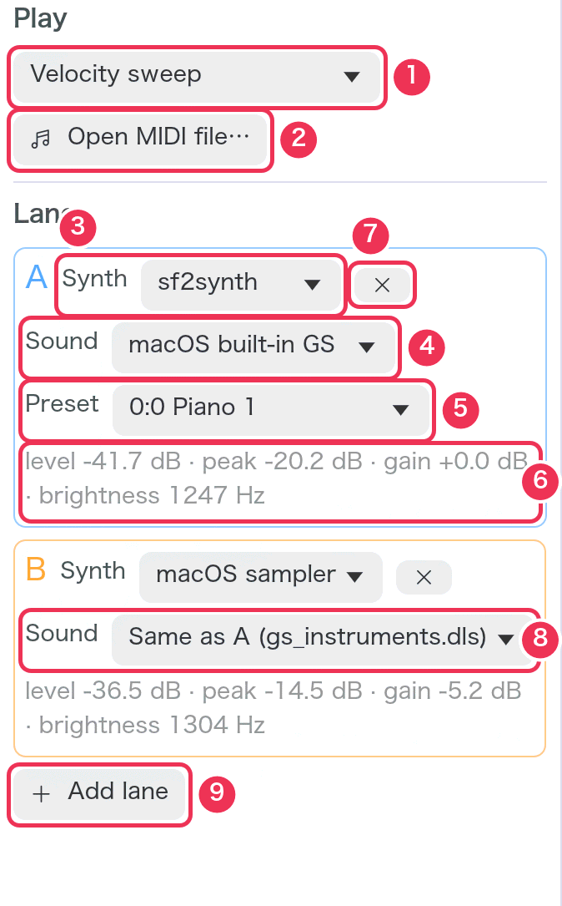
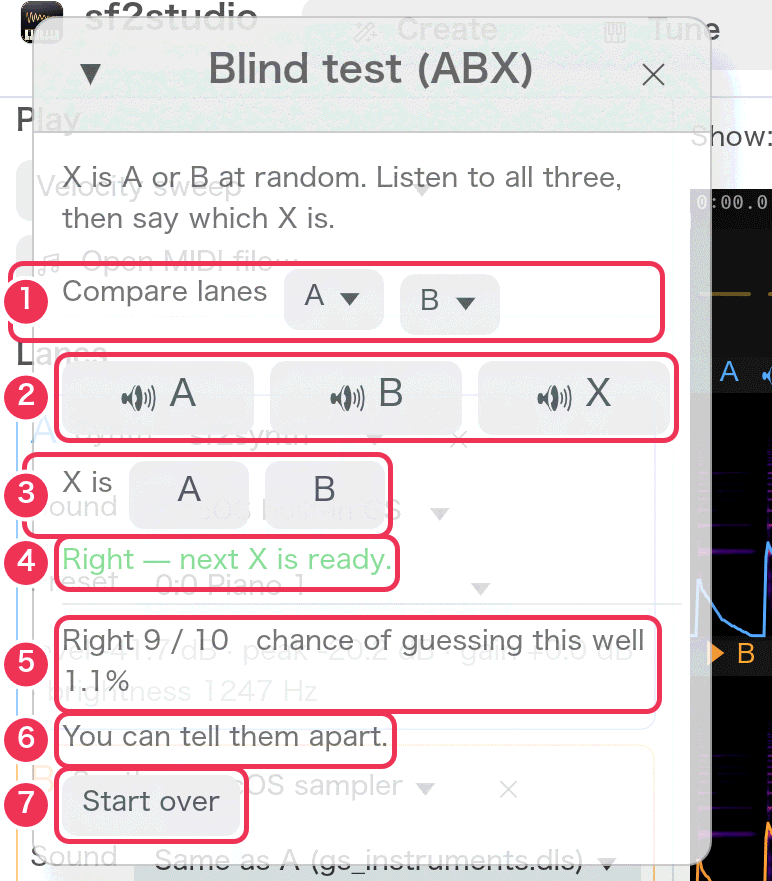
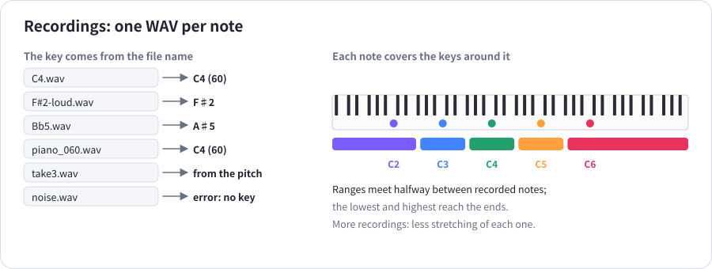
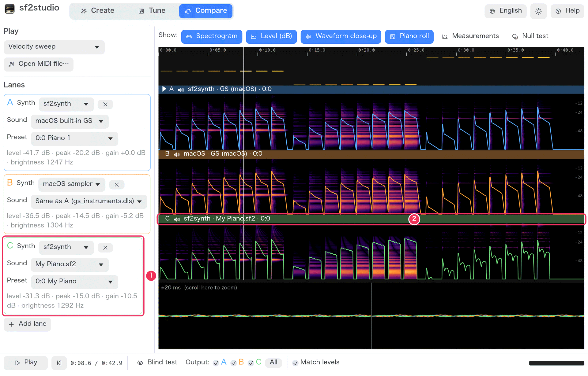

# Recipes

[Guide](README.md) › Recipes

Step-by-step instructions for common tasks. Words in **bold** are what you
click or choose in the app.

**Comparing**

1. [Compare two SF2 files](#1-compare-two-sf2-files)
2. [Hear how sf2synth and the macOS sampler differ on one SF2](#2-hear-how-sf2synth-and-the-macos-sampler-differ-on-one-sf2)
3. [Compare a recording with an SF2](#3-compare-a-recording-with-an-sf2)
4. [Find out whether you can really hear a difference](#4-find-out-whether-you-can-really-hear-a-difference)
5. [See how loudness and brightness follow velocity](#5-see-how-loudness-and-brightness-follow-velocity)
6. [Compare how long notes ring across the keyboard](#6-compare-how-long-notes-ring-across-the-keyboard)

**Tuning**

7. [Look at one note's harmonics](#7-look-at-one-notes-harmonics)
8. [Adjust sf2synth's touch and keep the settings](#8-adjust-sf2synths-touch-and-keep-the-settings)

**Making**

9. [Make a brighter, longer version of an SF2 piano](#9-make-a-brighter-longer-version-of-an-sf2-piano)
10. [Make an SF2 from recordings](#10-make-an-sf2-from-recordings)
11. [Make a piano SF2 without any files](#11-make-a-piano-sf2-without-any-files)
12. [Check a new instrument against the original](#12-check-a-new-instrument-against-the-original)

**Listening and playing**

13. [Listen to one passage over and over](#13-listen-to-one-passage-over-and-over)
14. [Compare instruments on your own song](#14-compare-instruments-on-your-own-song)
15. [Play with a MIDI keyboard](#15-play-with-a-midi-keyboard)
16. [Play exactly the same note again and again](#16-play-exactly-the-same-note-again-and-again)

**Converting**

17. [Save an instrument as a small SFZ and prove it sounds the same](#17-save-an-instrument-as-a-small-sfz-and-prove-it-sounds-the-same)

---

## 1. Compare two SF2 files

1. Switch to **Compare**.
2. In lane **A**, set **Synth** to **sf2synth**, open **Sound** and choose
   **Choose a file (SF2 / DLS / SFZ)…**, and pick the first SF2. Choose the
   instrument under **Preset**.
3. In lane **B**, do the same with the second SF2 (Synth **sf2synth** too, so
   only the instrument differs). Need a third? **Add lane**.
4. Under **Play**, choose a test pattern — **Chords, soft to loud** is a good
   start — or **Open MIDI file…**.
5. Leave **Match levels** on so that loudness doesn't decide for you.
6. Press **Space**. While it plays, press **1** and **2** (or click the
   **Output** boxes) to switch lanes on and off, or **Tab** to hear one lane
   after the other.
7. Compare the [spectrograms](reading-the-display.md#the-spectrogram-and-the-level-line)
   and the lane figures (level, brightness) too.

## 2. Hear how sf2synth and the macOS sampler differ on one SF2

This is how sf2studio starts on macOS.

1. **Compare**. Lane **A**: Synth **sf2synth**, Sound your SF2 (or the
   built-in GS set).
2. Lane **B**: Synth **macOS sampler**, Sound **Same as A** — it follows A's
   file and preset.
3. Choose **Velocity sweep** and press **Space**; switch with **Tab**.
4. Turn on **Measurements** under **Show** to see whether both respond to
   velocity alike (see [Recipe 5](#5-see-how-loudness-and-brightness-follow-velocity)).
5. If sf2synth should behave more like the sampler (or the other way), adjust
   it in **Tune** ([Recipe 8](#8-adjust-sf2synths-touch-and-keep-the-settings)).

## 3. Compare a recording with an SF2

A WAV lane plays its file from the start, whatever is chosen under Play, so
the recording must be of the same music.

1. Record your instrument (a real piano, a hardware synth, another app)
   playing a MIDI file, and save it as WAV.
2. **Compare** → **Open MIDI file…** → the same MIDI file.
3. Lane A: **sf2synth** with the SF2. **Add lane** → set its **Synth** to
   **WAV recording** → **Choose a WAV…** → your recording.
4. Check that the notes line up on the timeline: the spectrograms' notes
   should start under the same piano-roll notes. If the recording starts
   late, trim its silence in an audio editor so it starts with the first
   note (the test patterns start at 0.2 s).
5. Play and switch as in Recipe 1.

## 4. Find out whether you can really hear a difference

1. Set up the two lanes (Recipes 1–3). Keep **Match levels** on — level
   differences are easy to hear and hide everything else.
2. Shift-drag over a short passage on the timeline to loop it.
3. Turn on **Blind test**. In its window, choose the two lanes under
   **Compare lanes**.
4. Listen to **🔊 A**, **🔊 B** and **🔊 X** as often as you like, then answer
   **X is A** or **X is B**.
5. Repeat at least 8 times. The window shows how many were right and the
   chance of doing that well by guessing; under 5 % it says **You can tell
   them apart**.
6. Close the window (or turn off Blind test) to see which lane is which again.

## 5. See how loudness and brightness follow velocity

1. **Compare**, the lanes to compare, **Play → Velocity sweep**.
2. **Show → Measurements** on (and **Relative to each key's maximum** on).
3. Read the charts:
   - **Velocity → level**: steeper = more difference between soft and loud.
   - **Velocity → brightness**: rising = harder notes are brighter.
4. To change sf2synth's response, see Recipe 8; to change an instrument's,
   **Touch** in [Create](create.md#touch-parameters-layers-baked).

## 6. Compare how long notes ring across the keyboard

1. **Compare** → **Play → Long notes (decay)**.
2. **Measurements** on: **Decay per key** shows the seconds to fall 40 dB
   from C1 to C7, one line per lane.
3. On the timeline, compare the slope of each lane's level line and how far
   up the spectrogram's stripes last.

## 7. Look at one note's harmonics

1. **Tune**. Select an **sf2synth** lane with an SF2 (**Hear: A**).
2. Optionally turn off **Waveform close-up** and **Piano roll** under
   **Show** for taller lanes.
3. Press a key and hold it as long as the note should last; release it.
4. Every lane now shows that note. The green lines mark the fundamental and
   harmonics ×2 … ×8; pinch or Ctrl-scroll to zoom in.
5. Press **Space** to hear it; **1**/**2** or **Tab** to hear the other lanes.

## 8. Adjust sf2synth's touch and keep the settings

1. **Tune**, **Hear** the sf2synth lane to adjust.
2. Turn on **Fixed velocity** if you want to repeat the same strength.
3. Play soft and loud notes (press near the top of a key for soft, near the
   bottom for loud) and adjust on the right:
   - soft notes too quiet → lower **Range (cB)** or choose **Concave**;
   - soft notes too bright → more negative **Soft notes darker**;
   - the whole lane too loud or quiet → **Master gain**.
4. Each change re-renders the lane; play the same key again to hear it.
5. **Save…** writes the settings as a TOML file. **Load…** brings them back —
   into this or any other sf2synth lane. **Reset** returns to the defaults.

The same TOML can configure sf2synth in your own program; see
[Reference](reference.md#the-settings-file-toml).

## 9. Make a brighter, longer version of an SF2 piano

1. **Create** → **Start from: An SF2 / SFZ** → **Choose an SF2, DLS or SFZ…** → the
   piano → choose its **preset**.
2. Type a **Name**.
3. **Brightness (highs)** up a few dB for a crisper tone; **Warmth (lows)**
   down a little if the bass gets muddy.
4. **Fade while held** to the time a held note should ring (for example 15
   s), **Release** to how long it rings after you let go (for example 0.8 s).
5. Play it on the keyboard after each change (it is ready a moment later).
6. **Save SF2…**.

## 10. Make an SF2 from recordings

1. Record the instrument one note per file — every few semitones is enough
   (each recording covers the keys halfway to its neighbours). Let each note
   ring as long as it should in the instrument.
2. Name the files with their notes: `C2.wav`, `F#2.wav`, `C3.wav` … (or MIDI
   numbers such as `piano_048.wav`).
3. **Create** → **Start from: Recordings** → **Add WAV files…** → select them
   all. Check that each file shows the right key.
4. Shape it (Touch: **Velocity layers** 2–3 for a natural change of tone
   from soft to loud) and play it.
5. **Save SF2…**.

## 11. Make a piano SF2 without any files

1. **Create** → **Start from: Synthesis**.
2. Adjust **Brightness**, **String stiffness**, **Decay (middle C)**,
   **String detune** and **Hammer noise** while playing the keyboard.
3. Shape it in the centre if you like, then **Save SF2…**.

## 12. Check a new instrument against the original

1. In **Create**, make the instrument (Recipes 9–11).
2. Click **Compare with others**. It goes into a new lane (for example C).
3. Switch to **Compare**. The original is still in lane A; play and switch as
   in Recipe 1, or run the blind test (Recipe 4).
4. Go back to **Create** to change something: the lane in Compare is updated
   automatically after each change.

## 13. Listen to one passage over and over

- **Shift-drag** across the timeline: that range loops (shaded). **L** or the
  **×** next to the range in the transport clears it.
- Or **click a note in the piano roll**: that note loops and plays.
- Use **←** / **→** to jump 5 s, **Home** for the start.

## 14. Compare instruments on your own song

1. **Compare** (or Tune) → **Open MIDI file…** → your `.mid` file.
2. Each lane's preset replaces the instrument on every channel except drums;
   program changes in the file still apply. For a fair comparison, use a
   file for one instrument (for example a piano piece).
3. Play and switch as in Recipe 1.

## 15. Play with a MIDI keyboard

1. Connect the keyboard, go to **Tune** (or Create).
2. Open the **MIDI keyboard** menu above the keys (it lists the inputs found
   now) and choose yours.
3. Play. Notes sound with no extra delay through the lane you hear (Tune) or
   the instrument being made (Create); each note is rendered in every lane
   when released (Tune).

## 16. Play exactly the same note again and again

1. **Tune** → **Fixed velocity** on, set the slider (for example 100).
2. **Fixed length** on, set the time (for example 2 s).
3. Click a key: it plays at that velocity for that time, however you click.
   Change a setting and click again to hear exactly the difference.

## 17. Save an instrument as a small SFZ and prove it sounds the same

1. Make (or re-voice) an instrument in **Create**.
2. **Save SFZ…** and choose a name: the SFZ file is written with its
   samples as lossless FLAC in a folder beside it.
3. **Compare with others** — a lane plays the instrument as made.
4. **Compare** → **Add lane** → **Sound** → **Choose a file (SF2 / DLS /
   SFZ)…** → the SFZ you saved.
5. **Show: Null test**, and choose those two lanes: “bit-identical” — the
   SFZ plays exactly as the SF2 does.
