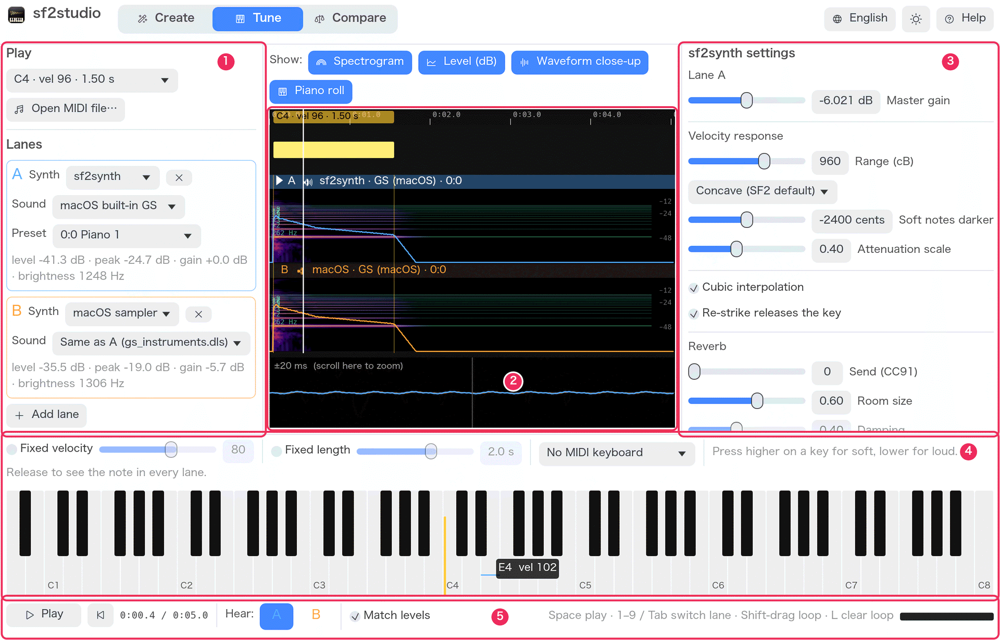
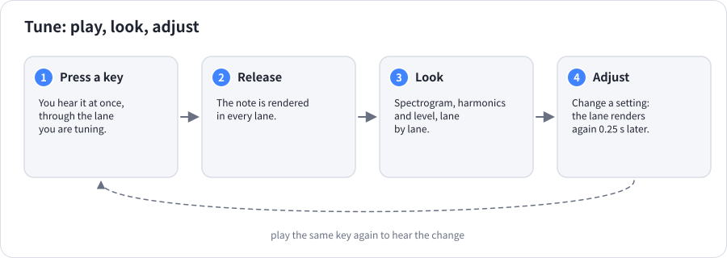
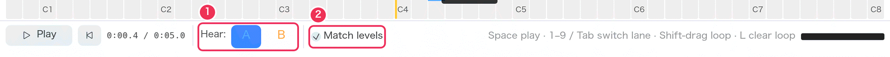
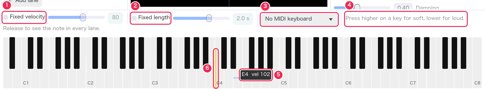
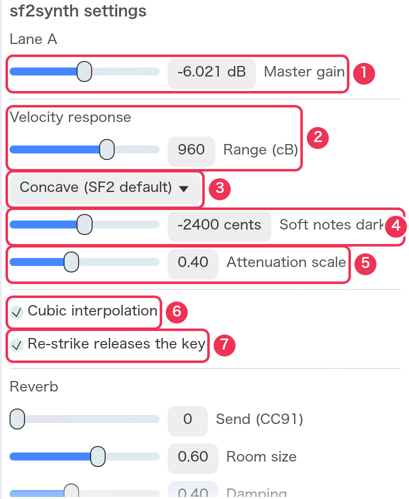
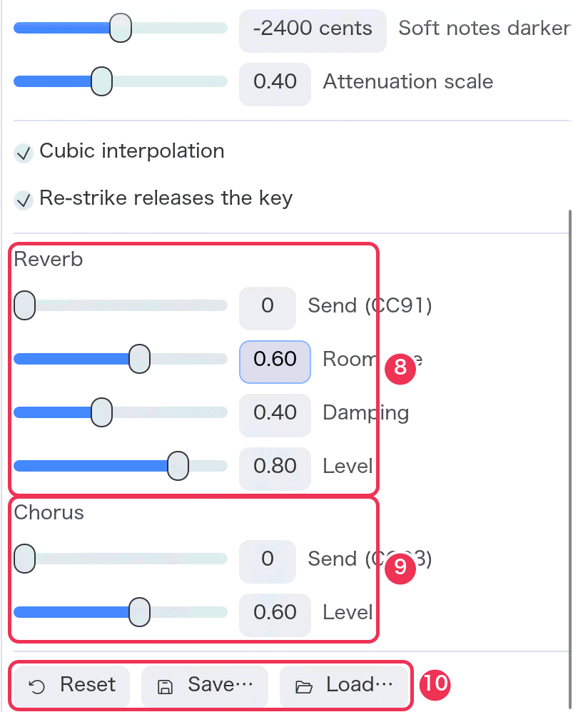
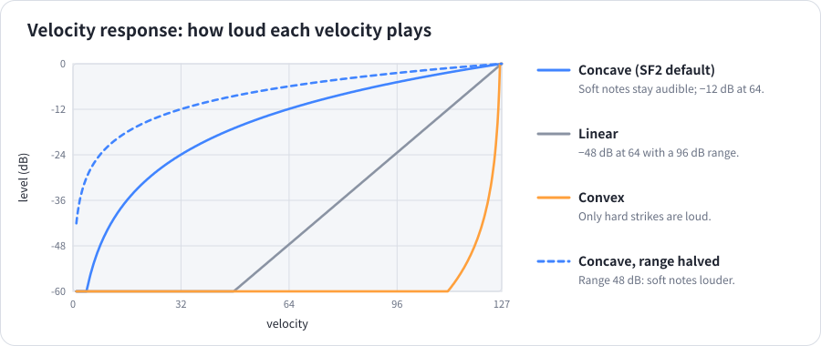
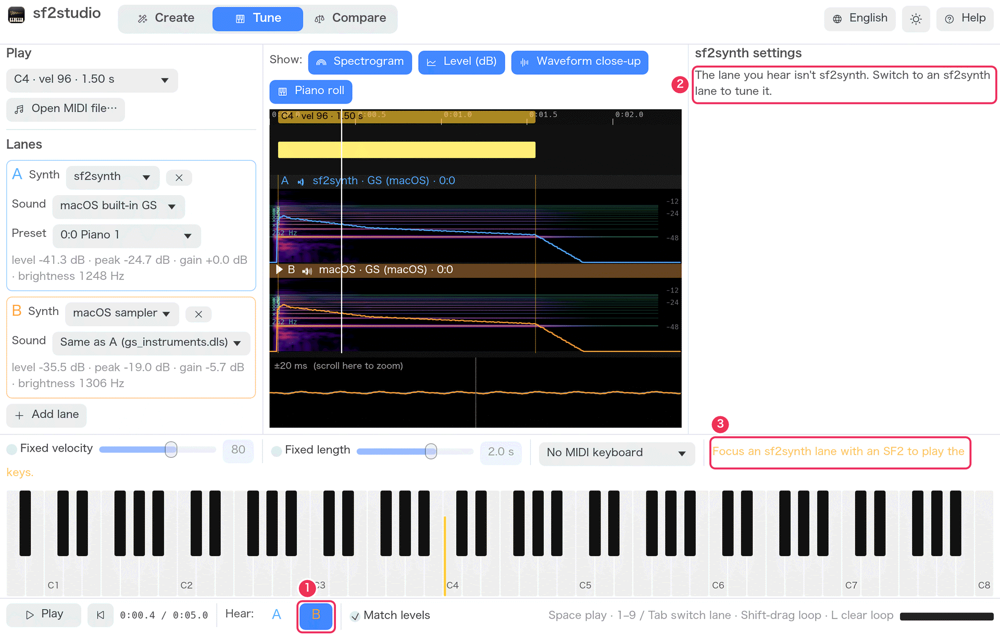

# Tune

[Guide](README.md) › Tune

Tune is for playing an instrument and adjusting sf2synth while you listen.
A key sounds the moment you press it; when you let go, that one note is
rendered in **every** lane so you can look at it — and hear it — lane by
lane.

1. **Left panel** — what is played and the lanes, as in [Compare](compare.md#lanes).
2. **Timeline** — the lanes, here showing the last note played.
3. **sf2synth settings** of the lane you hear.
4. **Keyboard** — 88 keys, A0 to C8.
5. **Transport** — which lane you hear.

## The lane you hear

In Tune you hear **one lane at a time**: the one selected in the transport
(or with keys 1–9, or Tab for the next). The keyboard plays through that
lane, and the settings on the right belong to it.

1. **Hear** — the lane you hear and tune.
2. **Match levels** — as in Compare: lanes are brought to the same loudness,
   and the keyboard plays at its lane's matched level too.

## The keyboard

**Where you press sets the velocity.** Near the top (back) of a key is
soft, near the bottom (front) loud. As the pointer moves over the keys, a
line and a label (**⑤**, for example `E4  vel 102`) show the key and the
velocity a press there would give. Hold the key as long as the note should
last; drag across keys for a glissando. After a note, a yellow bar on its
key (**⑥**) shows how hard it was played.

1. **Fixed velocity** — every press plays at the slider's velocity (1–127),
   wherever you press. Use it to repeat the exact same note.
2. **Fixed length** — every note lasts the slider's time (0.1–10 s) however
   long you hold. The note is rendered when that time is up.
3. **MIDI keyboard** — choose a connected MIDI keyboard (the list is
   refreshed each time you open it). Its notes go straight to the
   synthesizer, so it plays with no extra delay, and its keys light up on
   the screen. Velocity and length come from the MIDI keyboard.
4. A reminder of how the keys work.

The keyboard panel's top edge can be dragged to make the keys taller.

When you press a key, playback of the lanes stops so the key is heard alone.

### What happens when you release

The lanes are rendered again playing just that note — key, velocity and
length — and the timeline zooms to show all of it. The “Play” menu in the
left panel then shows the note, for example `C4 · vel 96 · 1.50 s`. Press
**Space** to hear the note in the selected lane, switch lanes with 1–9 or
Tab, and compare.

1. The note: as long as it was held, as strong as its color.
2. The note's fundamental (here 262 Hz, C4) and harmonics ×2 to ×8, drawn
   as green lines over the spectrogram. Strong partials sit on the lines;
   energy between them is noise or inharmonicity.
3. Lane A (▶: the lane you hear).
4. Lane B, the same note through the other synth.
5. The level line's scale (dB).

## sf2synth settings

The right panel adjusts sf2synth for the lane you hear. Every sf2synth lane
has its own settings, kept between launches. After a change, the lane is
rendered again a quarter of a second later and the keyboard plays the new
settings at once.

<table><tr>
<td valign="top"></td>
<td valign="top"></td>
</tr></table>

| # | Setting | What it is for | Range (default) | What changes |
|---|---|---|---|---|
| 1 | **Master gain** | The lane's overall volume | −24 to +12 dB (−6 dB) | Louder or quieter everywhere. Watch the meter for clipping. With Match levels on you hear little difference — the lanes are evened out. |
| 2 | **Velocity response · Range (cB)** | How much quieter the softest note is than the loudest | 0–1440 cB (960 = 96 dB) | Lower: soft notes louder, less dynamic. Higher: more contrast. |
| 3 | **Curve** | How loudness rises with velocity | Concave (SF2 default), Linear, Convex | See the chart below. Concave keeps soft notes audible; Linear and Convex make soft playing much quieter. |
| 4 | **Soft notes darker** | How much softer notes are filtered | −4800 to 0 cents (−2400) | More negative: soft notes duller, loud ones bright. 0 turns the filter off: every velocity equally bright. |
| 5 | **Attenuation scale** | How strongly the file's own volume settings count | 0–1 (0.40) | 0.4 is how E-mu hardware (and most SF2 files made for it) reads them; 1.0 follows the SF2 specification literally and makes such files quieter. |
| 6 | **Cubic interpolation** | Sample playback quality | on | Off: linear interpolation — slightly duller, with faint aliasing on high notes. |
| 7 | **Re-strike releases the key** | What happens when a key is played again while still sounding | on | On: the previous note is released, as a piano string stops when struck again. Off: the notes overlap and pile up. |
| 8 | **Reverb** — Send (CC91), Room size, Damping, Level | Room sound | Send 0–127 (0); the others 0–1 | **Send** is sent to every channel before playing (a MIDI file may change it). Nothing is heard with Send 0. Room size: longer tail. Damping: duller tail. Level: how loud the reverb is. |
| 9 | **Chorus** — Send (CC93), Level | Shimmer and width | Send 0–127 (0); Level 0–1 | As for reverb. |
| 10 | **Reset · Save… · Load…** | | | **Reset** returns this lane to the defaults. **Save…** writes the settings as TOML (`sf2synth.toml`), **Load…** reads them back — into any sf2synth lane. |

The TOML file also holds two settings without a slider: `reverb_width` and
`max_voices`. See [Reference](reference.md#the-settings-file-toml).

### When the lane you hear isn't sf2synth

1. Lane B (the macOS sampler) is selected.
2. Its settings can't be changed here — the macOS sampler has none of these.
3. The keyboard doesn't sound: it plays through sf2synth only. Select an
   sf2synth lane that has an instrument file.

## Next

- [Recipe 7: look at one note's harmonics](recipes.md#7-look-at-one-notes-harmonics)
- [Recipe 8: adjust and save sf2synth's touch](recipes.md#8-adjust-sf2synths-touch-and-keep-the-settings)
