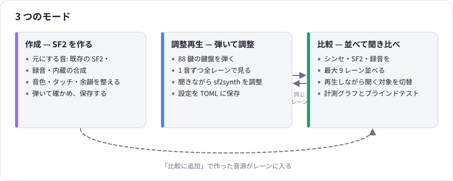
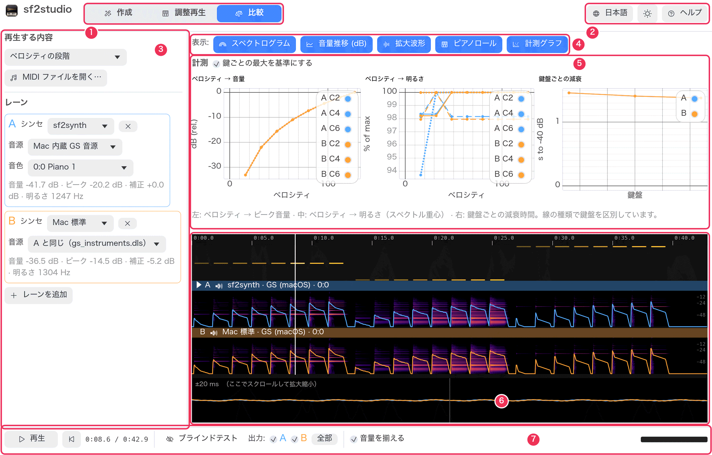

# sf2studio ガイド

sf2studio は、SF2 音源を作り、調整し、聞き比べるためのアプリです。
[sf2synth](https://github.com/albos-inc/sf2synth)（macOS では OS 標準のサンプラーも）で鳴らし、
鳴った音を図にして見せ、曲を流したまま音源を切り替えて聞き比べられます。

## ページ一覧

| ページ | 内容 |
|---|---|
| [はじめに](getting-started.md) | 画面の構成、上部バー、メニュー、初回起動、記憶される設定 |
| [比較モード](compare.md) | レーン、再生する内容、聞く対象の切り替え、音量を揃える、計測グラフ、ブラインドテスト |
| [調整再生モード](tune.md) | 鍵盤、1 音を全レーンで書き出す仕組み、sf2synth の全設定、TOML への保存 |
| [作成モード](create.md) | 既存の SF2・録音・合成から SF2 を作る、整えるための全設定、保存と比較 |
| [表示の見方](reading-the-display.md) | スペクトログラム、音量推移、拡大波形、ピアノロール、倍音、鍵盤の表示、計測グラフ |
| [やりたいこと別の手順](recipes.md) | 「〜したい」から引く手順集 |
| [リファレンス](reference.md) | キー操作、マウス操作、コマンドライン、ファイル、保存される内容、困ったとき、用語集 |

## どこから読むか

- **2 つの音源の違いを聞きたい** → [手順 1](recipes.md#r1)
- **SF2 が弱く・強く弾いたときにどう反応するか調べたい** → [手順 5](recipes.md#r5)
- **自分のピアノ SF2 を作りたい** → [手順 9](recipes.md#r9)
- **本当に違いが聞き分けられるか確かめたい** → [手順 4](recipes.md#r4)

## 画面のあらまし

1. **モード切り替え** — 作成・調整再生・比較。
2. **言語・テーマ・ヘルプ。**
3. **左パネル** — 再生する内容と、それを鳴らすレーン。
4. **表示** — タイムラインに何を描くかの切り替え。
5. **計測グラフ**（比較モードのみ）。
6. **タイムライン** — 各レーンのスペクトログラムと音量。上にピアノロール、下に拡大波形。
7. **再生バー** — 再生、位置、聞くレーン、音量を揃える、出力レベル。

アプリでは **ヘルプ → 使い方** で要点を確認でき、そこからこのガイドを開けます。
