# 比較モード

[ガイド](README.md) › 比較モード

比較モードでは、最大 9 本の **レーン** を並べます。各レーンは同じ曲を、違うシンセ・違う音源ファイル・
または録音で鳴らします。全レーンを一度に見ながら、再生中に「どのレーンを聞くか」を切り替えられます。
切り替えはサンプル単位で揃い、音量も揃い、プチッというノイズも出ないので、変わるのは音色だけです。

## 再生する内容

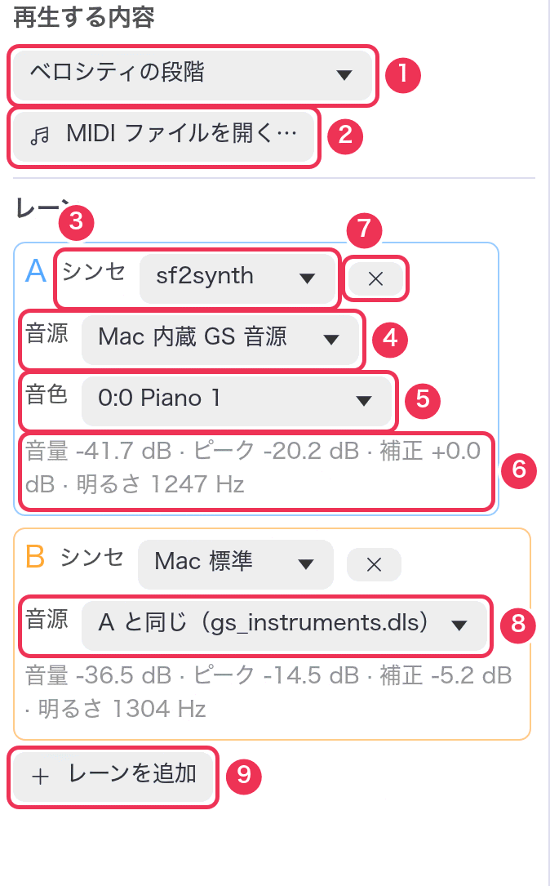

**① 再生する内容。** 音源の特定の性質を調べるための 5 つのテストパターンから選びます。
すべてのレーンが同じものを鳴らします。

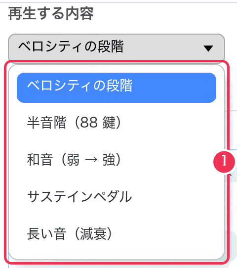

| テストパターン | 鳴らすもの | 何を見るのに使うか |
|---|---|---|
| ベロシティの段階 | C4、続いて C2 と C6 を、ベロシティ 16, 32 … 127 の 8 段階で（各 1.2 秒） | 強さに応じて音量・明るさがどう変わるか。[ベロシティのグラフ](#charts) |
| 半音階（88 鍵） | A0 から C8 まで全鍵盤をベロシティ 80 で（各 0.25 秒） | 音のばらつき、サンプルの切れ目、音域全体の音程 |
| 和音（弱 → 強） | C2 から C6 まで C メジャーの 4 和音を、ベロシティ 30 → 127 で | 音の混ざり方、厚み |
| サステインペダル | ペダルを踏んだままのアルペジオ 3 回、ペダルを離す、続いて同じものをペダルなしで | ペダルの響き、音の止まり方 |
| 長い音（減衰） | C1 から C7 まで 1 オクターブごとに、ベロシティ 96 で 6 秒ずつ | 減衰と余韻。[減衰のグラフ](#charts) |

**② MIDI ファイルを開く…** で、スタンダード MIDI ファイル（`.mid`、`.midi`、`.kar`、`.rmi`）を
鳴らすこともできます。レーンの音色はドラム（10 チャンネル）以外の全チャンネルに設定されますが、
ファイル内のプログラムチェンジはそのまま効きます。

[調整再生モード](tune.md) で鍵盤を弾くと、レーンはその 1 音だけを鳴らすようになり、
このメニューにはその音（例 `C4 · vel 96 · 1.50 s`）が表示されます。
パターンを選び直すと元に戻ります。

再生する内容を変えると、再生位置は先頭に戻り、ループは解除され、全レーンを書き出し直します。

## レーン

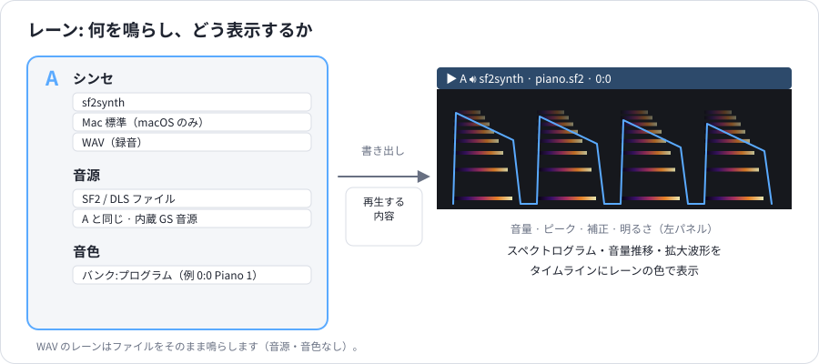

レーンは **シンセ**、そのシンセが鳴らす **音源**、音源の中の **音色** の組み合わせ（または録音）です。
レーンには A〜I の名前と色があり、左パネル・タイムライン・グラフ・再生バーで同じ色を使います。

| パネルの項目 | 働き |
|---|---|
| **③ シンセ** | **sf2synth** — このアプリの土台のシンセ。**Mac 標準** — Apple の AVAudioUnitSampler。iOS や macOS のアプリの多くが SF2 をこれで鳴らします（macOS のみ）。**WAV（録音）** — 音声ファイルをそのまま鳴らします。 |
| **④ 音源** | 鳴らす音源ファイル。**ファイルを選ぶ（SF2 / DLS）…**、macOS / Windows の **内蔵 GS 音源**、またはレーン B 以降なら **A と同じ**。 |
| **⑤ 音色** | ファイルの中のどの楽器を使うか（`バンク:プログラム 名前`）。Mac 標準では General MIDI の 128 音色とドラム（128:0）が並びます。「A と同じ」のときは表示されません。 |
| **⑥ レーンの数値** | **音量**（鳴っている部分の平均）· **ピーク** · **補正**（音量を揃えるための補正量）· **明るさ**（代表的なスペクトル重心。高いほど明るい音）。書き出し中は「書き出し中…」、鳴らせないときは赤字で理由が出ます。 |
| **⑦ ×** | レーンを削除します（最低 1 本は残ります）。 |
| **⑧ A と同じ** | レーン A のファイルと音色に従います。A を変えればこのレーンも変わります。同じ音源でシンセ同士を比べるのに便利です。 |
| **⑨ レーンを追加** | 「A と同じ」の sf2synth レーンを追加します（最大 9 本）。 |

<table><tr>
<td valign="top">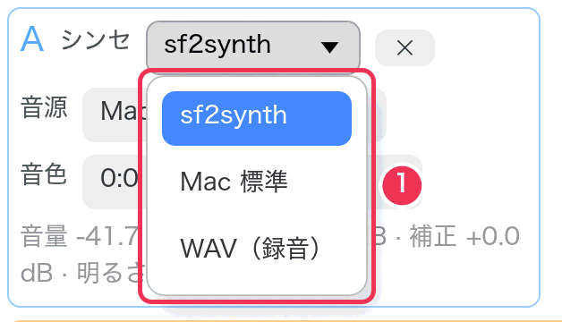</td>
<td valign="top">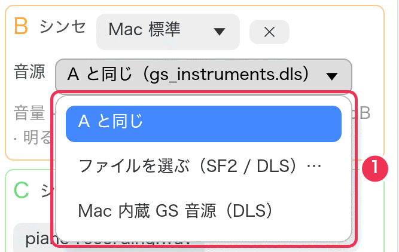</td>
</tr></table>

WAV のレーンには、音源と音色の代わりに **WAV を選ぶ…** ボタンが 1 つ出ます。
録音は「再生する内容」に関係なく、ファイルの先頭からそのまま鳴ります。
ほかのレーンと同じ MIDI ファイルを演奏した録音を使ってください（[手順 3](recipes.md#r3)）。

レーンは設定が変わると裏で書き出し直されます。その間もほかのレーンは鳴り続けます。

## 再生バー

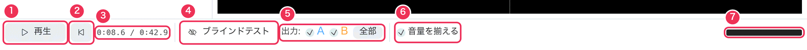

1. **再生 / 一時停止**（Space）
2. **先頭へ**（Home）
3. **再生位置 / 長さ**（分:秒）
4. **ブラインドテスト** — [ABX テスト](#abx) を開きます。
5. **出力** — 聞くレーン。チェックボックス（または 1〜9 キー）で再生中にオン・オフします。
   **Shift**+クリック（または Shift+1〜9）でそのレーンだけ、**全部** で全レーンを鳴らします。
   **Tab** で次のレーンだけを鳴らします。
6. **音量を揃える** — 下で説明します。
7. **出力レベル** — 緑。音が割れると赤になります。

ループ中はその範囲と、解除用の × も表示されます。右側には、幅に余裕があればキー操作のヒントが出ます。

### 1 つのレーンだけを聞く

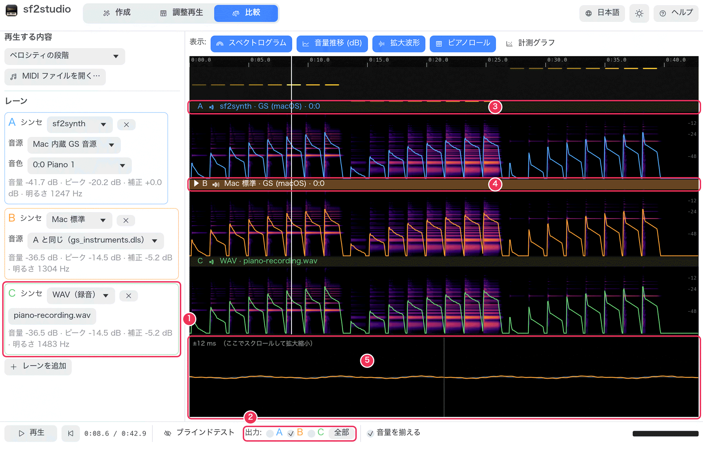

1. 3 本目のレーン。ここでは **WAV（録音）**。
2. 出力は **B** だけにチェック。
3. レーン A のヘッダーは灰色でスピーカーも静か。聞こえていません。
4. レーン B のヘッダーはレーンの色。▶ は最後に選んだレーンの印です。
5. 拡大波形では、聞こえているレーンが明るく手前に、ほかは薄く描かれます。

### 音量を揃える

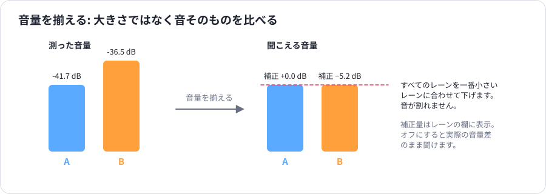

音量の違う 2 つの音源は、比べるのが難しいものです。大きい方がたいてい「良い音」に聞こえるからです。
**音量を揃える** をオンにすると、すべてのレーンを、鳴っている部分の平均音量が一番小さいレーンに合わせて下げます。
補正量は各レーンの数値の **補正** に表示されます。タイムラインも揃えた音量で描きます
（絵が暗くならないよう、一番大きいレーン基準）。オフにすると、実際の音量差のまま聞けます。

## 表示

使わない表示を消すと、残りの表示が広くなります。

1. **スペクトログラム** — 各レーンの色の図。
2. **音量推移 (dB)** — その上の線。
3. **拡大波形** — 下の帯。
4. **ピアノロール** — レーンの上に並ぶ、鳴らしている音符。
5. **計測グラフ** — グラフ（比較モードのみ）。

それぞれの見方は [表示の見方](reading-the-display.md) へ。

## 計測グラフ

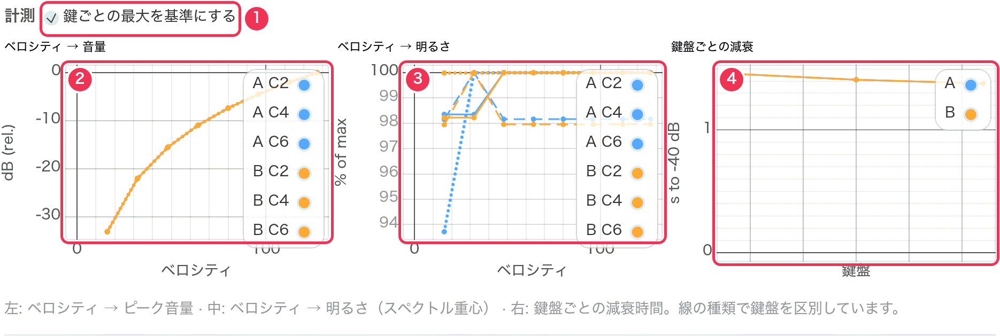

「再生する内容」の音のうち、前後 0.3 秒にほかの音がない単独の音を、レーンごとに測ります。
測れる内容のときだけ表示されます。**ベロシティの段階**、**長い音**、**半音階** を選んでください。

1. **鍵ごとの最大を基準にする** — オンにすると、各鍵盤の音量は一番大きい音からの差、
   明るさは一番明るい音に対する割合で表示します。音量の違う鍵盤やレーンの「形」を比べやすくなります。
   オフでは dB と Hz の絶対値です。
2. **ベロシティ → 音量** — ベロシティごとのピーク音量。線 1 本がレーンと鍵盤の組み合わせ
   （線の種類で鍵盤を区別）。傾きが急なほど、弱音と強音の差が大きい音源です。
3. **ベロシティ → 明るさ** — 鳴り始め直後のスペクトル重心。右上がりなら、
   本物のピアノのように強く弾くほど明るい音になります。
4. **鍵盤ごとの減衰** — ピークから 40 dB 下がるまでの秒数を鍵盤ごとに。高いほど長く響きます。

詳しくは [表示の見方](reading-the-display.md#charts) へ。

## タイムライン

クリックで再生位置を移動、ドラッグで探り聞きできます。**Shift+ドラッグ** でループ範囲を設定し、
**L** で解除します。ピアノロールの音符をクリックすると、その音をループして再生します。
レーンのヘッダーをクリックするとそのレーンを選びます（▶）。ピンチまたは Ctrl+スクロールで拡大縮小、
スクロールで移動、ダブルクリックで全体表示に戻ります。詳しくは [表示の見方](reading-the-display.md) へ。

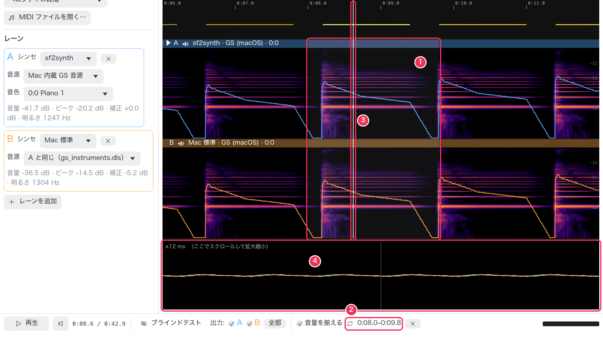

1. ループ範囲（薄い帯）。再生はこの範囲を繰り返します。
2. 再生バーに出るループ範囲。× で解除。
3. 再生位置。
4. 再生位置まわりの拡大波形。

## ブラインドテスト

本当に違いが聞こえているのか、聞こえる気がしているだけなのか。ABX テストで確かめられます。

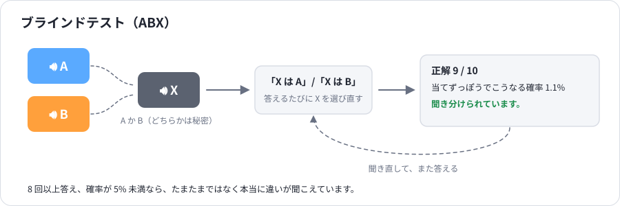

再生バーの **ブラインドテスト** をオンにします。テスト中は、どのレーンが鳴っているかが隠れます。
出力のチェックボックス、レーンのスピーカー表示、レーン切り替えのキーは、テストを閉じるまで使えません。

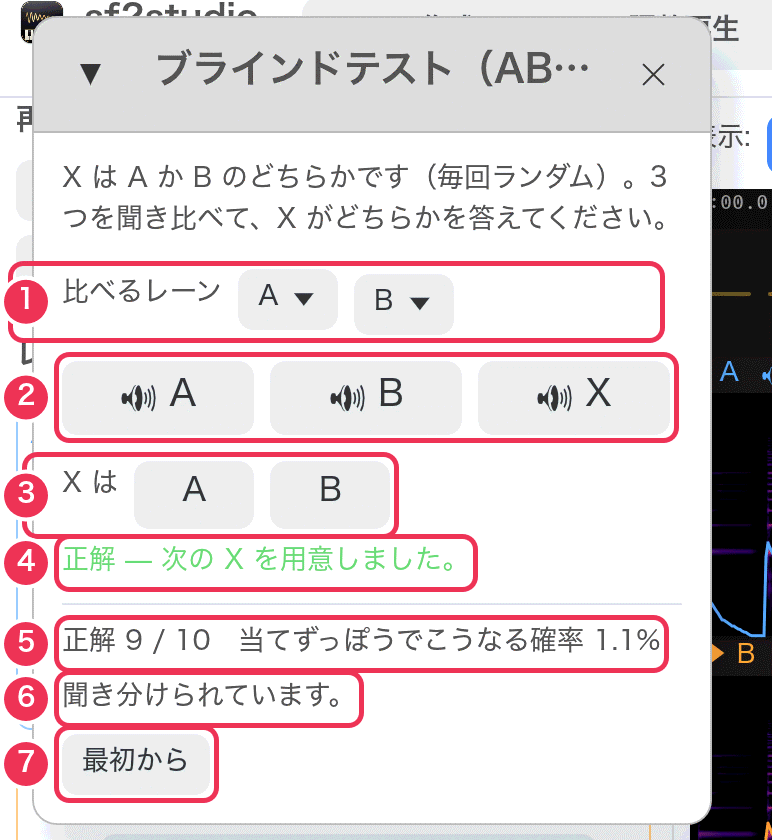

1. **比べるレーン** — テストする 2 本（既定は A と B）。
2. **🔊 A、🔊 B、🔊 X** — そのレーンで曲を鳴らします。X は A か B のどちらか（ランダム）。何度聞いても構いません。
3. **X は A / B** — 答えます。答えるたびに次の X が選び直されます。
4. 正解だったかどうか。
5. ここまでの正解数と、**当てずっぽうでこうなる確率**。
6. 8 回以上答えると判定が出ます。確率が 5% 未満なら「聞き分けられています」。
7. **最初から** で成績を消します。

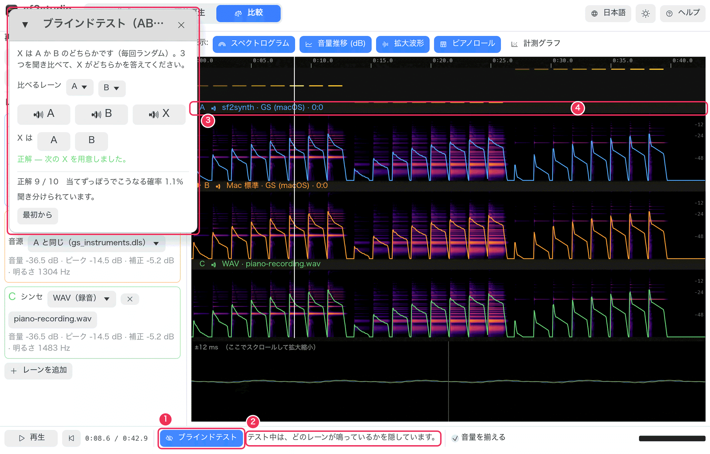

1. **ブラインドテスト** がオン。
2. どのレーンが鳴っているかは隠している、という表示。
3. テストのウィンドウ。
4. どのレーンのヘッダーも、聞こえているかどうかを示しません。

コツ: 先に短いループを設定しておく（数音の上を Shift+ドラッグ）と、A・B・X で同じ部分を聞き比べられます。
