# 作成モード

[ガイド](README.md) › 作成モード

作成モードでは、新しい SF2 音源を作ります。元にする音を選び、どう鳴らしたいかを整え、鍵盤で弾いて確かめます。
設定を変えるたびに少し待って作り直すので、弾きながら追い込めます。気に入ったら SF2 ファイルとして保存するか、
比較モードに送ってほかの音源と並べて聞きます。

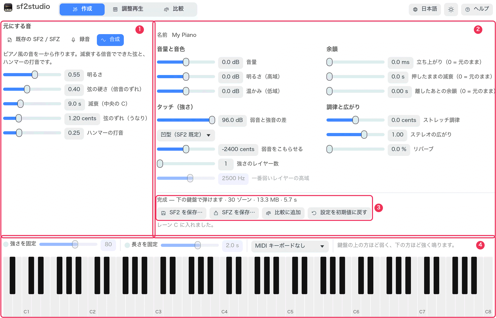

1. **元にする音** — 素材。既存の SF2、録音、または合成。
2. **音源を好みに整える** — 音量と音色、タッチ、余韻、調律と広がり。
3. **状態とボタン** — 保存、比較に追加、初期値に戻す。
4. **鍵盤** — 作っている音源を弾きます（[調整再生モード](tune.md) の鍵盤と同じ操作。レーンへの書き出しはしません）。

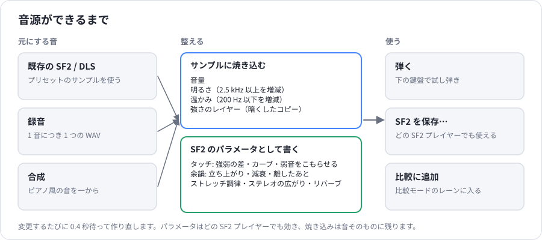

## 元にする音

### 既存の SF2 / SFZ

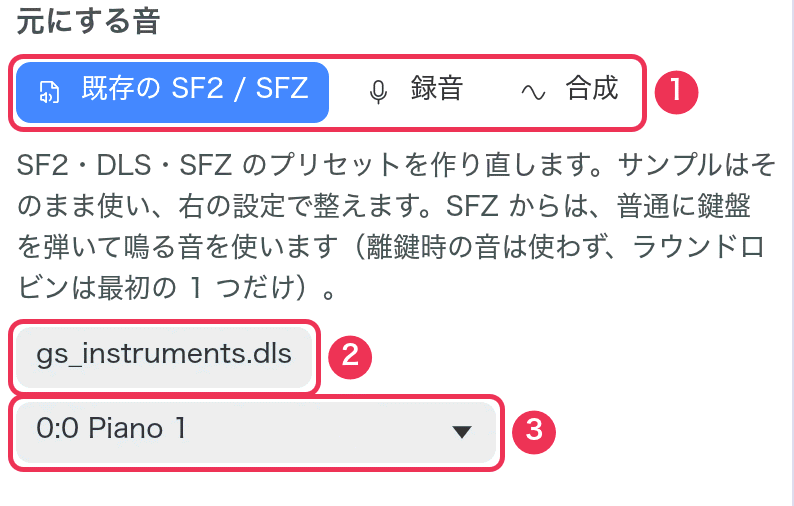

1. **既存の SF2 / SFZ** を選びます。
2. **SF2 / DLS / SFZ を選ぶ…** — 元にするファイル。DLS（OS 内蔵の GS 音源など）や SFZ も使えます。
   SFZ からは、普通に鍵盤を弾いて鳴るリージョンを、その音量のまま使います。
   離鍵時の音やコントローラーで鳴る音は使わず、ラウンドロビンは最初の 1 つだけを使います。
3. 作り直す **プリセット（音色）**。

プリセットのサンプル、鍵盤とベロシティの範囲、プリセット自身の設定はそのまま使い、
その上に中央の設定を加えます。

### 録音

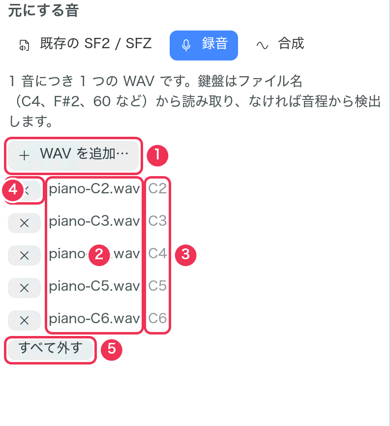

1 音につき 1 つの WAV ファイルを使います。たとえば、ピアノを 1 鍵ずつ録音したものです。

1. **WAV を追加…** — WAV ファイルを選びます（複数可。後から追加もできます）。
2. 使っているファイル。
3. ファイル名から読み取った鍵盤。
4. **×** でそのファイルを外します。
5. **すべて外す**。

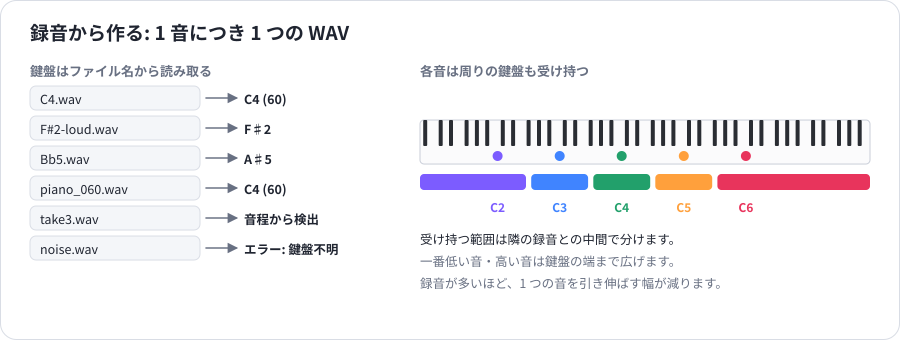

- **鍵盤** はファイル名から読み取ります。`C4`、`F#2`、`Bb5`、`Cs3`（C♯3）、または `piano_060` のような
  MIDI 番号（C4 = 60）。名前のほかの部分は無視するので、`Steinway C4 loud.wav` でも大丈夫です。
- 名前に鍵盤がなければ、音程を **検出** します（25 Hz〜4.5 kHz）。少しずれた音程は ±50 セントまで補正します。
- 各録音は、音が始まる直前から（先頭の無音は切り取って）モノラルで、ファイルの終わりまで鳴ります。
  楽器として響かせたい長さまで録音してください。無音のファイルや、名前に鍵盤がなく音程もはっきりしない
  ファイルはエラーになります。
- 各録音は、隣の録音との中間までの鍵盤を受け持ちます。一番低い音・高い音は鍵盤の端まで広げます。

### 合成

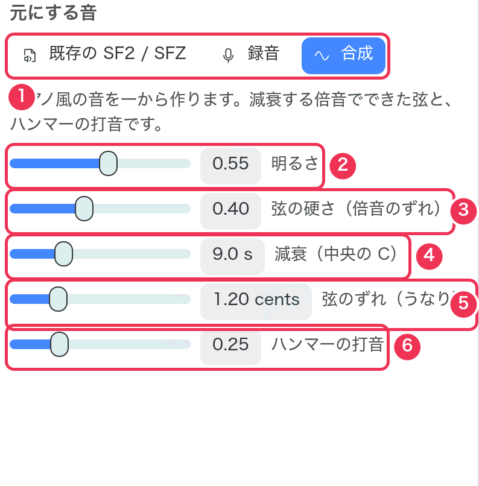

ファイルなしで、ピアノ風の音を一から作ります。3 鍵ごとに、わずかにずらした 3 本の弦（減衰する倍音の集まり）と
ハンマーの打音を合成します。

| # | 設定 | 範囲（既定） | 変えると |
|---|---|---|---|
| 1 | （**合成** を選ぶ） | | |
| 2 | **明るさ** | 0〜1（0.55） | 高い倍音の強さ。こもった音から明るい音まで。 |
| 3 | **弦の硬さ（倍音のずれ）** | 0〜1（0.40） | 本物のピアノ弦のように倍音を高めにずらします（高音ほど強く）。0 は完全に整数倍で、少し電子的な響き。 |
| 4 | **減衰（中央の C）** | 1〜30 秒（9 秒） | 中央の C が 60 dB 下がるまでの時間。高い音ほど速く減衰します。 |
| 5 | **弦のずれ（うなり）** | 0〜5 セント（1.2） | 1 つの音の弦同士をわずかにずらします。ゆっくりしたうなりで、コーラスのような温かみが出ます。 |
| 6 | **ハンマーの打音** | 0〜1（0.25） | 鳴り始めの「コン」という打音。 |

## 音源を好みに整える

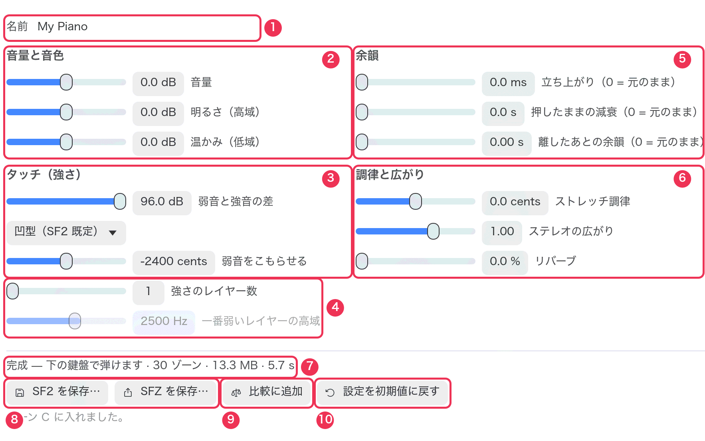

変更するたびに 0.4 秒待って作り直します。設定には 2 種類あります。**焼き込み** はサンプルそのものを変え、
**パラメータ** は SF2 の中に書き込むので、どの SF2 プレイヤーでも同じように効きます。

**① 名前** — SF2 の中の楽器名で、保存するときのファイル名にもなります。

### 音量と音色（焼き込み）

スクリーンショットの ②。

| 設定 | 範囲（既定） | 変えると |
|---|---|---|
| **音量** | ±12 dB（0） | サンプルの音量。ほかの音源と合わせるのに使います。出力レベルが赤くなるほど上げないでください。 |
| **明るさ（高域）** | ±12 dB（0） | 約 2.5 kHz 以上の高域。＋でくっきり、−でやわらかく。 |
| **温かみ（低域）** | ±12 dB（0） | 約 200 Hz 以下の低域。＋で豊かに、−ですっきり。 |

### タッチ（パラメータ。レイヤーは焼き込み）

スクリーンショットの ③ と ④。

| 設定 | 範囲（既定） | 変えると |
|---|---|---|
| **弱音と強音の差** | 0〜96 dB（96） | ベロシティ 1 が 127 よりどれだけ小さいか。小さくすると強弱の差が縮まり、均一な弾き心地になります。 |
| **カーブ** | 凹型（SF2 既定）・直線・凸型 | 強さに応じた音量の上がり方。[グラフ](tune.md#settings) 参照。 |
| **弱音をこもらせる** | −4800〜0 セント（−2400） | 弱い音ほど高域を削ります。0 ならどの強さでも同じ音色。 |
| **強さのレイヤー数**（④） | 1〜4（1） | 弱い強さ用に、高域を削ったサンプルのコピーを作ります。弱音から強音への音色の変化が自然になります。 |
| **一番弱いレイヤーの高域** | 500〜8000 Hz（2500） | 一番弱いレイヤーをどれだけ暗くするか（レイヤーが 2 以上のときだけ）。 |

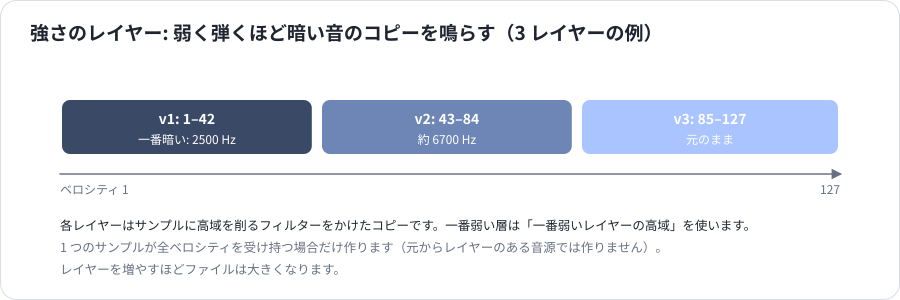

### 余韻（パラメータ）

スクリーンショットの ⑤。

| 設定 | 範囲（既定） | 変えると |
|---|---|---|
| **立ち上がり** | 0〜100 ms（0 = 元のまま） | 鳴り始めをゆっくりにして、アタックをやわらげます。 |
| **押したままの減衰** | 0〜30 秒（0 = 元のまま） | 押し続けた音が消えるまでの時間。0 はサンプル自身の減衰のままです。 |
| **離したあとの余韻** | 0〜5 秒（0 = 元のまま） | 鍵盤を離した後に鳴り続ける時間。 |

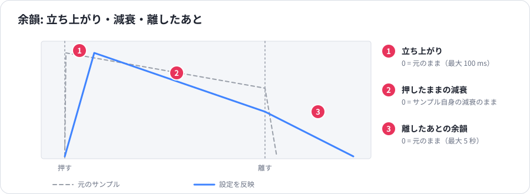

### 調律と広がり（パラメータ）

スクリーンショットの ⑥。

| 設定 | 範囲（既定） | 変えると |
|---|---|---|
| **ストレッチ調律** | ±30 セント（0） | ＋で高音を高め・低音を低めに（ピアノの調律と同じ傾向）、−でその逆。中央の C は動かさず、4 オクターブ離れたところで設定値いっぱいになります。 |
| **ステレオの広がり** | 0〜1.5（1.00） | 元の音源の、音ごとの左右の配置を拡大縮小します。0 でモノラル、1 で元のまま、1 より上で広く。左右の配置を持つのは SF2 から作った場合だけで、録音と合成は中央です。 |
| **リバーブ** | 0〜100 %（0） | プレイヤーのリバーブにどれだけ送るか。 |

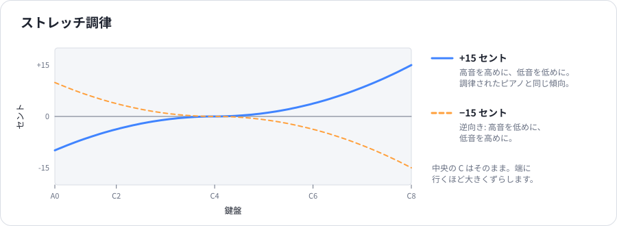

### 状態とボタン

7. **状態** — 作成中は進み具合のバー。できあがると
   `完成 — 下の鍵盤で弾けます · 30 ゾーン · 13.3 MB · 5.6 s`
   （ゾーン = サンプルの受け持ち範囲の数、ファイルの大きさ、作るのにかかった時間）。エラーは赤字で出ます。
8. **SF2 を保存…** · **SFZ を保存…** — SF2 ファイルとして、または SFZ ファイルとして書き出します。
   SFZ では、サンプルを可逆圧縮の FLAC にして隣のフォルダ（`<名前> samples`）に保存します。
   sf2synth ではどちらもまったく同じ音で鳴り、SFZ のサイズは数分の一です。SFZ の書き出しはバックグラウンドで行います。
9. **比較に追加** — この音源を鳴らすレーンを追加します（前に追加したレーンがあれば更新）。
   以後は作り直すたびにそのレーンも更新されるので、比較モードではいつも最新の音を聞けます。
10. **設定を初期値に戻す** — 整える設定をすべて既定値に戻します（名前は残します）。

鍵盤は、作った音源を sf2synth の既定の設定で鳴らします。

## 比較モードに送る

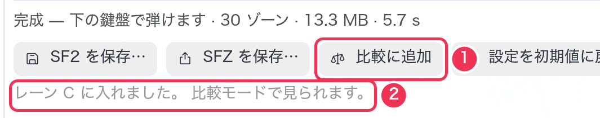

1. **比較に追加**。
2. 入ったレーン。

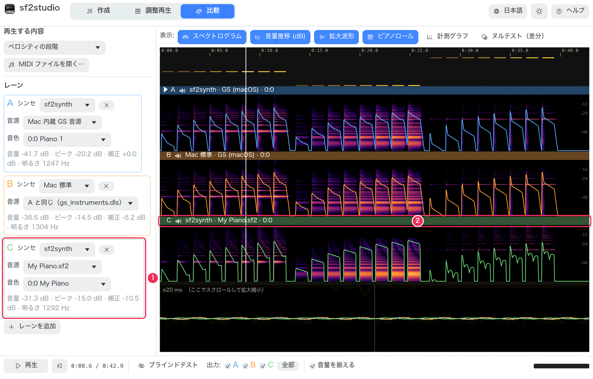

1. レーン C が新しい音源（`My_Piano.sf2`。OS の一時フォルダーの作業用コピーなので、残すには **SF2 を保存…**）を鳴らします。
2. 元にした音源と並ぶ、そのレーンのタイムライン。

## 次に読む

- [手順 9: SF2 のピアノを明るく、余韻を長くする](recipes.md#r9)
- [手順 10: 録音から SF2 を作る](recipes.md#r10)
- [手順 11: ファイルなしでピアノの SF2 を作る](recipes.md#r11)
