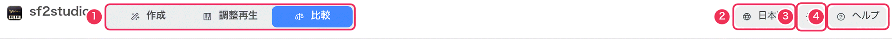
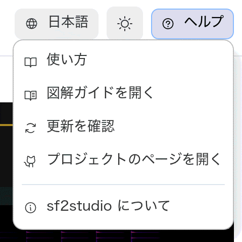
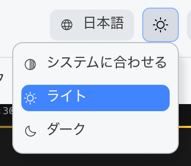
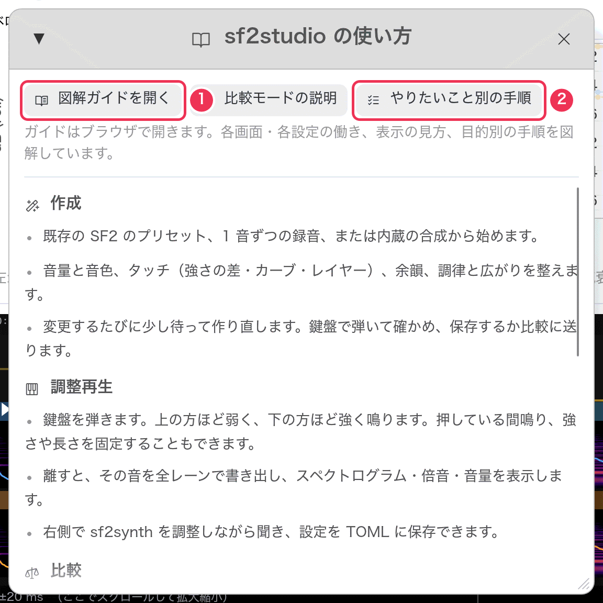

# はじめに

[ガイド](README.md) › はじめに

## 起動する

sf2studio は macOS と Windows で動きます。ソースからは次のように起動します。

```sh
cargo run --release
```

## 初めて起動したとき

sf2studio は **比較** モードで開き、何も選ばなくてもすぐ音が出る状態になっています。

| | macOS | Windows |
|---|---|---|
| レーン A | sf2synth で OS 内蔵の GS 音源（DLS）を鳴らす | sf2synth で Windows の GS 音源（`gm.dls`）を鳴らす |
| レーン B | Mac 標準のサンプラーで同じ音源を鳴らす | WAV のレーン（録音を選びます） |
| 再生する内容 | テストパターン「ベロシティの段階」 | 同じ |

macOS ならそのまま **Space** を押すだけで、sf2synth と Apple のサンプラーが同じピアノを
鳴らす様子を聞き比べられます。表示言語は OS の設定（英語か日本語）に合わせます。

## 画面の構成

上部バーはどのモードでも共通です。その下はモードによって変わります。

| | 作成 | 調整再生 | 比較 |
|---|---|---|---|
| 左パネル | 元にする音 | 再生する内容とレーン | 再生する内容とレーン |
| 中央 | 音源を整える設定 | タイムライン | 計測グラフとタイムライン |
| 右パネル | — | 聞いているレーンの sf2synth の設定 | — |
| 下 | 鍵盤 | 鍵盤と再生バー | 再生バー |

パネルの境目はドラッグして幅を変えられます。鍵盤の高さも変えられます。


## 上部バー



1. **モード切り替え** — **作成** は SF2 を作る、**調整再生** は鍵盤で 1 つのレーンを弾いて
   調整する、**比較** はレーンを並べて聞き比べるモードです。レーンと再生する内容は
   調整再生と比較で共通なので、行き来しながら作業できます。
2. **言語** — English か日本語。すぐに切り替わります。
3. **テーマ** — システムに合わせる・ライト・ダーク。タイムラインはどちらでも暗い背景のままなので、
   スペクトログラムの見え方は変わりません。
4. **ヘルプ** — 下のメニューです。

音声出力を開けなかったときは、言語メニューの左に赤いスピーカーのアイコンと理由が出ます
（表示はそのまま使えます）。

<table><tr>
<td valign="top"></td>
<td valign="top"><br></td>
</tr></table>

| ヘルプメニュー | 働き |
|---|---|
| 使い方 | 3 つのモードとキー操作の要点。このガイド（全体・今のモードのページ・手順集）を開くボタンがあります。 |
| 図解ガイドを開く | このガイドをブラウザで開きます（アプリの表示言語で）。 |
| 更新を確認 | GitHub の最新リリースを調べ、今の版と比べます。新しい版があればダウンロードページを開くボタンが出ます。勝手にダウンロードはしません。 |
| プロジェクトのページを開く | GitHub のリポジトリを開きます。 |
| sf2studio について | バージョン、ライセンス、使っているライブラリ。 |



1. **図解ガイドを開く**。隣は今のモードの説明ページを開くボタンです。
2. **やりたいこと別の手順** — よくある作業の手順集を開きます。

## 記憶される設定

終了するとき、sf2studio は次を覚えておき、次回そのまま始めます。

- 言語・テーマ・モード
- 再生する内容（テストパターン、MIDI ファイル、または最後に弾いた鍵盤の音）
- すべてのレーン（シンセ、音源ファイル、音色、sf2synth の設定）
- **音量を揃える**、**表示** の切り替え、鍵盤の設定
- 作成モードの「元にする音」と、整えるための全設定

作成モードで作った音源そのものは **保存されません**。残すには **SF2 を保存…** を使います。
再生位置・ループ・拡大の状態は毎回最初からです。

## 次に読む

- [比較モード](compare.md) — 起動時に開くモードです。
- [やりたいこと別の手順](recipes.md) — したいことが決まっている場合はこちら。
