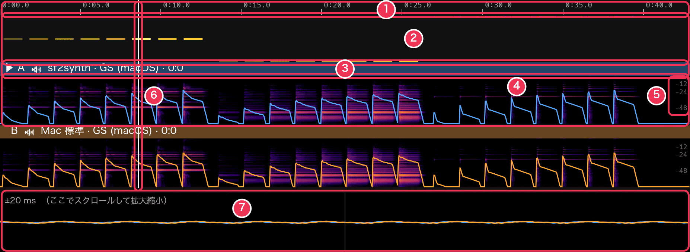
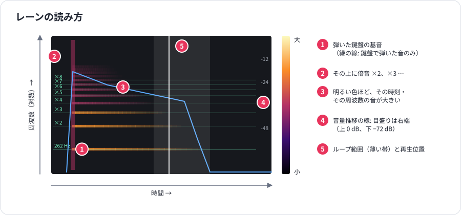

# 表示の見方

[ガイド](README.md) › 表示の見方

各レーンの図は、そのレーンを書き出した音から描いています。見えているものは、聞こえているものそのものです。
このページでは各部分の意味と、何に注目すればよいかを説明します。

## タイムライン

1. **目盛り** — 時間（分:秒）。鍵盤で弾いた後は、その音を黄色い帯でも示します（押していた長さで、色の濃さが強さ）。
2. **ピアノロール** — 鳴らしている音符を低い音から高い音へ。強い音ほど明るく描き、再生位置で鳴っている音符は光ります。
   **音符をクリック** すると、その音をループして再生します。
3. **レーンのヘッダー** — ▶（選んでいるレーン）、レーン名、聞こえていれば 🔊（聞こえていなければ 🔈）、
   シンセ、ファイル、音色。聞こえている間はレーンの色で塗られます。クリックでそのレーンを選びます。
4. **スペクトログラム** と、その上の **音量推移の線**（下で説明）。
5. **音量の目盛り** — 音量推移の線の −12、−24、−48 dB。
6. **再生位置** — どこを再生しているか。クリックやドラッグで動かせます。
7. **拡大波形** — 再生位置のまわりの各レーンの波形（下で説明）。

### 動かし方

| 操作 | 結果 |
|---|---|
| クリック / ドラッグ | 再生位置を移動 |
| Shift+ドラッグ | ループ範囲を設定（L か × で解除） |
| ピアノロールの音符をクリック | その音をループして再生 |
| ピンチ、または Ctrl+スクロール | ポインタの位置を中心に拡大縮小 |
| スクロール | タイムラインを左右に移動 |
| ダブルクリック | 全体表示に戻す（再生位置への追従も再開） |

再生中は、表示が再生位置を追いかけます。自分で拡大やスクロールをすると追従は止まり、ダブルクリックで再開します。

## スペクトログラムと音量推移

- **横**: 時間。**縦**: 周波数（対数）。下端が 27.5 Hz（A0）、上端が 18 kHz で、どのオクターブも同じ高さです。
- **色**: その時刻・その周波数の音の大きさ。黒（無音）から紫・赤を経て淡い黄色（大きい）まで。
- **横縞** は音の倍音です。きれいなピアノの音は、上から順に消えていく縞のはしごに見えます（高い倍音ほど早く消える）。
- **縦のにじみ** が音の始まりにあれば、それはアタック（ハンマーやクリック音）です。
- **音量推移の線** はレーンの音量（dB。上端 0 dB、下端 −72 dB）。音ごとに鋭く立ち上がり、その後に減衰します。
  まっすぐな下り坂は一定の速さの減衰、折れ曲がりは途中で減衰の速さが変わることを表します。

「音量を揃える」がオンのときは、**一番大きいレーンに揃えて** 描くので、同じ色はレーンをまたいでも同じ音量です。

レーン同士で見比べるポイント:

| 見るところ | わかること |
|---|---|
| 明るい縞がどこまで上に届くか | 明るさ。明るい音源ほど上まで届きます |
| 上の方の縞が消える速さ | アタックの後、音色がどれだけ早く暗くなるか |
| 音量推移の傾き | 音が減衰する速さ |
| 音が終わった後の部分 | 離したあとの余韻。長くにじむならリバーブか長いリリース |
| 縞の揺れや二重 | 弦のずれ（うなり）、コーラス |
| 縞と縞の間のノイズ | ハンマーや弦のノイズ、リバーブ、サンプルの不具合 |

## 鍵盤で弾いた音の倍音

[調整再生モード](tune.md) で鍵盤を弾いた後は、その音の基音（周波数つき。ここでは 262 Hz）と
倍音 ×2〜×8（薄い線で ×16 まで）の、本来あるべき位置を緑の線で示します。
高い倍音ほど線より少し上にずれているのは、本物のピアノ弦の性質（倍音のずれ）です。
どの線からも離れた縞は、ノイズか合っていないサンプルです。

## 拡大波形

下の帯は、再生位置のまわりの各レーンの波形です（最初は ±20 ms）。**帯の上でスクロール** すると
±1 ms から ±500 ms まで拡大縮小できます。聞こえているレーンは明るく手前に、ほかは薄く描きます。
位相や波形の形の違い、クリック音、遅れて鳴り始めるレーンを見つけるのに使います。

## レーンの数値

左パネルで、各レーンの下に表示されます。

`音量 −41.7 dB · ピーク −20.2 dB · 補正 +0.0 dB · 明るさ 1247 Hz`

| 数値 | 意味 |
|---|---|
| 音量 | 鳴っている部分の平均（RMS）音量 |
| ピーク | 一番大きなサンプルの値。0 dB に近いほど音割れに近い |
| 補正 | 「音量を揃える」でかけている補正量 |
| 明るさ | 代表的なスペクトル重心（スペクトルの「重心」）。高いほど明るい音 |

## 計測グラフ

線 1 本がレーン（色）と鍵盤（線の種類）の組み合わせで、点 1 つがテストパターンの 1 音です。

- **ベロシティ → 音量**（②）: 傾きが急なほど、弱く弾いた音と強く弾いた音の差が大きい音源です。
  上の方で平らになるなら、一番強いあたりではほとんど大きくならないということ。段差はベロシティレイヤーの境目です。
- **ベロシティ → 明るさ**（③）: 強さとともに上がるのが自然です。平らなら、どの強さでも同じ音色（音量だけが変わる）。
  飛びがあればレイヤーの境目です。
- **鍵盤ごとの減衰**（④）: 40 dB 下がるまでの秒数を鍵盤ごとに。高音ほど短くなるのが普通です。
  1 つの鍵盤だけ低ければ、短いサンプルかループの不具合を疑います。

**鍵ごとの最大を基準にする**（①）をオンにすると、各鍵盤をその鍵盤の一番大きい音・一番明るい音から測るので、
全体の音量の違いに隠れず、反応の「形」を比べられます。

## 鍵盤の表示

- ポインタの下の **線とラベル**: その位置を押したときの鍵盤と強さ。
- 鍵盤の上の **黄色いバー**: 最後に弾いた音。高さが強さを表します。
- **光る鍵盤**: 画面または MIDI キーボードで押している音。聞いているレーンの色で光ります。
- **C の表示**（C1〜C8）: 位置の目安。

## 出力レベル

再生バーの右端は、スピーカーに送っている音量です。普段は緑で、音が割れると赤になります。
赤くなったら、レーンの音量（調整再生の「全体の音量」、作成の「音量」）を下げるか、「音量を揃える」をオンにします。
