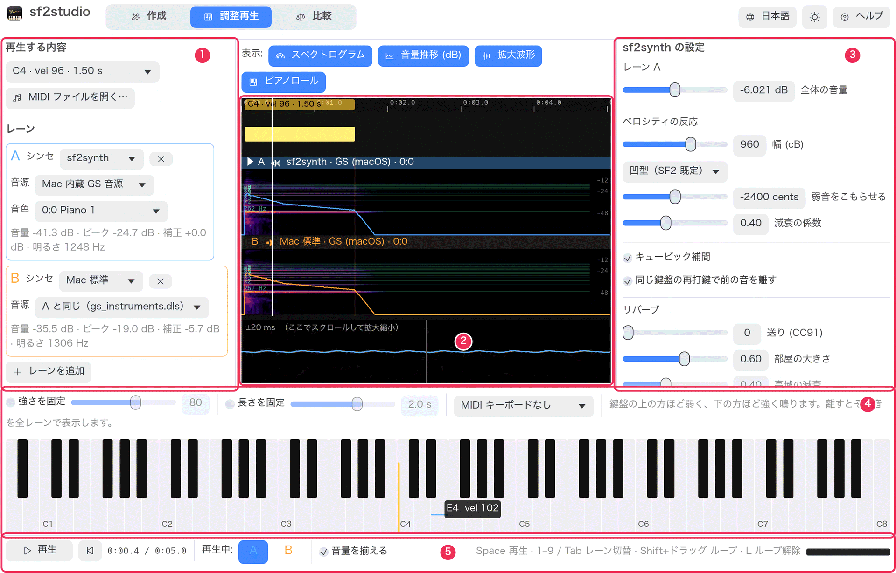
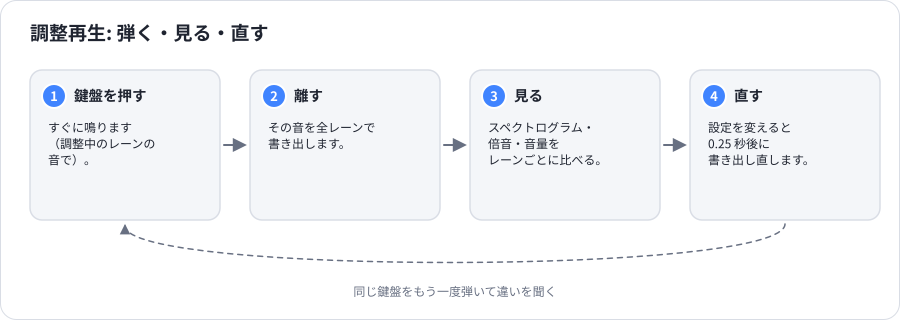
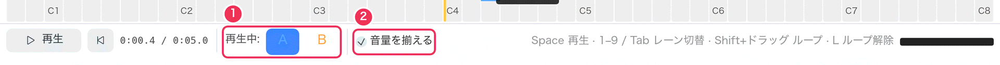
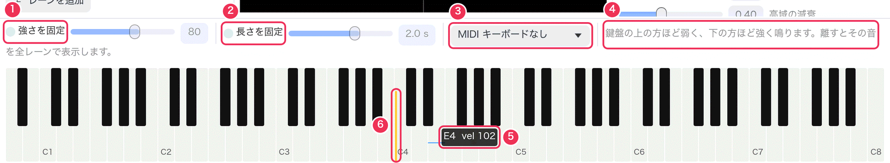
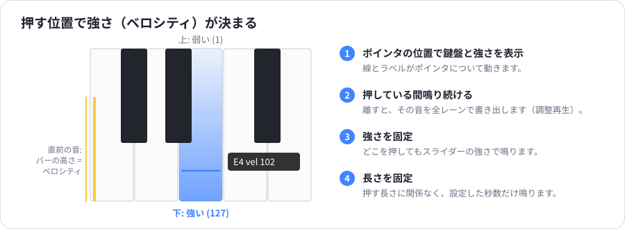
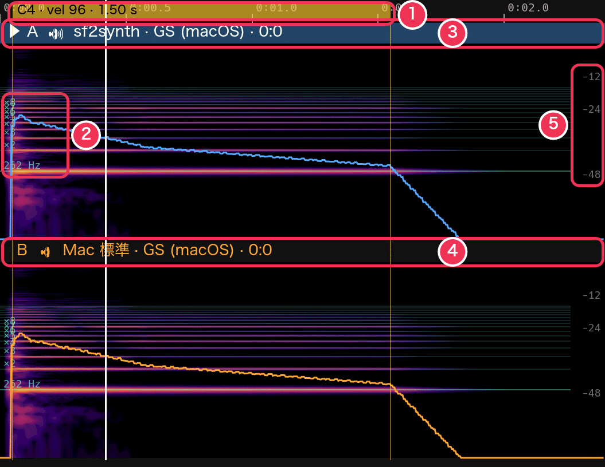
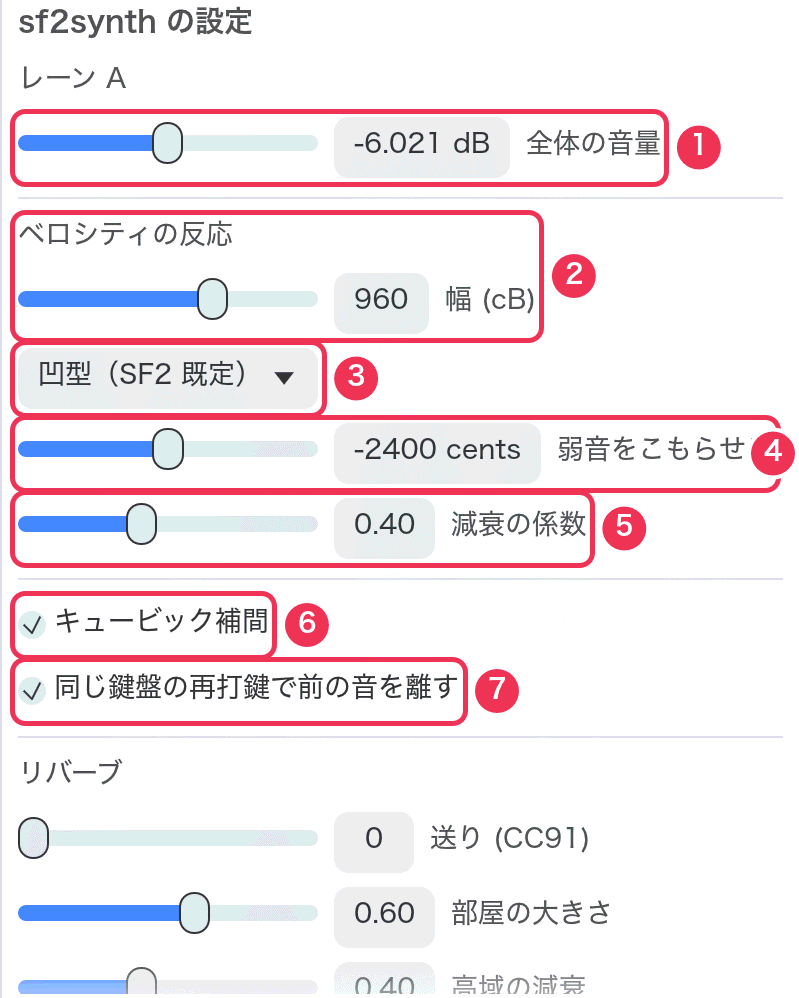
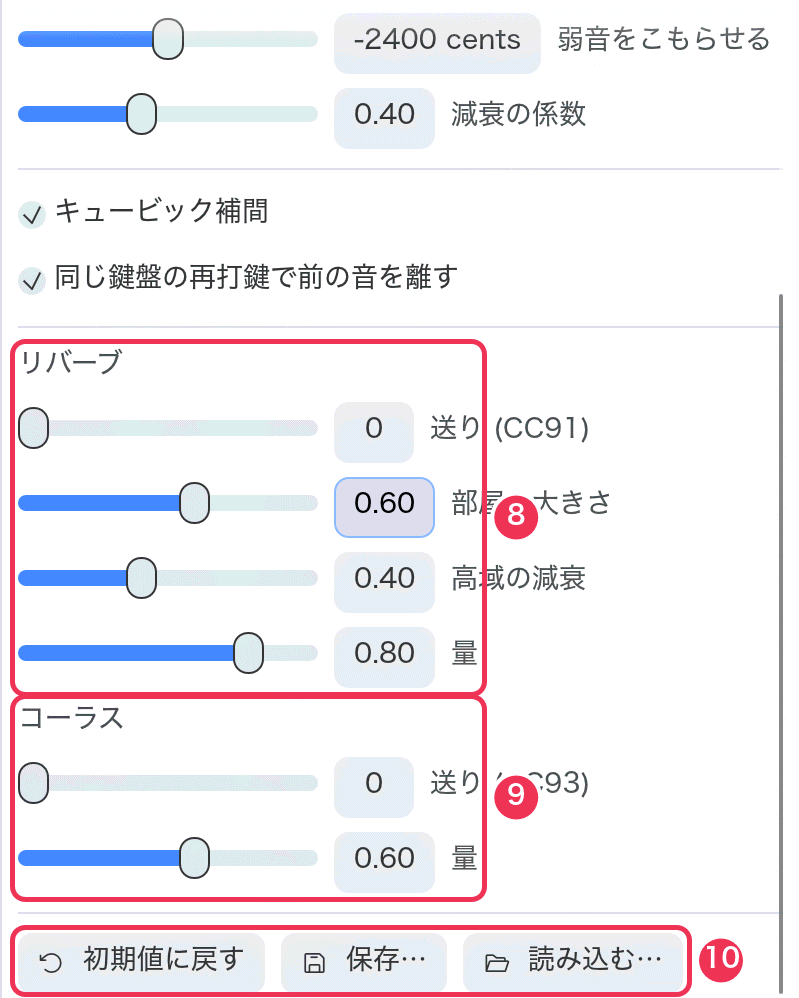
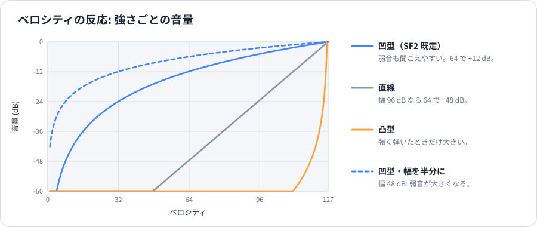
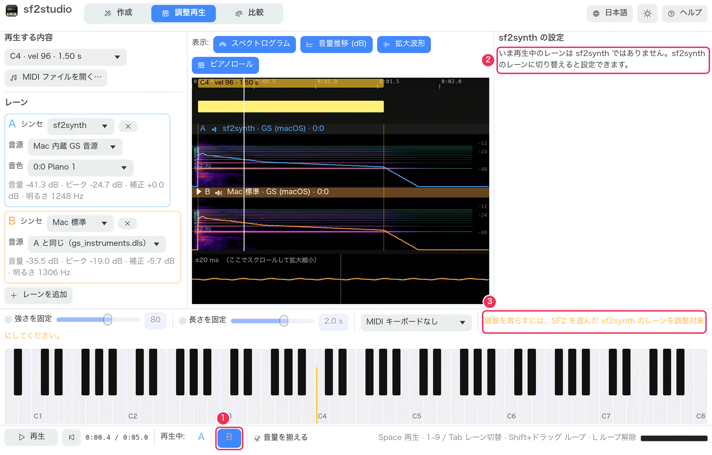

# 調整再生モード

[ガイド](README.md) › 調整再生モード

調整再生モードは、音源を弾きながら sf2synth を調整するためのモードです。鍵盤を押した瞬間に音が鳴り、
離すとその 1 音を **全レーン** で書き出すので、レーンごとに見比べ、聞き比べられます。

1. **左パネル** — 再生する内容とレーン（[比較モード](compare.md) と同じ）。
2. **タイムライン** — レーン。ここでは最後に弾いた音を表示しています。
3. **sf2synth の設定** — 聞いているレーンの設定。
4. **鍵盤** — A0 から C8 までの 88 鍵。
5. **再生バー** — 聞くレーンの切り替え。

## 聞いているレーン

調整再生モードでは、**一度に 1 本のレーン** だけを聞きます。再生バーで選んだレーン
（1〜9 キー、Tab で次のレーン）です。鍵盤はそのレーンの音で鳴り、右の設定もそのレーンのものです。

1. **再生中** — 聞いていて、調整しているレーン。
2. **音量を揃える** — 比較モードと同じく、レーンの音量を揃えます。鍵盤もそのレーンの揃えた音量で鳴ります。

## 鍵盤

**押す位置で強さ（ベロシティ）が決まります。** 鍵盤の上（奥）の方ほど弱く、下（手前）の方ほど強く鳴ります。
ポインタを鍵盤の上で動かすと、線とラベル（**⑤**、例 `E4  vel 102`）が、そこを押したときの鍵盤と強さを示します。
音を伸ばしたい間だけ押し続け、鍵盤の上をドラッグすればグリッサンドになります。
弾いた後は、その鍵盤に黄色いバー（**⑥**）が残り、どれだけ強く弾いたかを示します。

1. **強さを固定** — どこを押してもスライダーの強さ（1〜127）で鳴ります。まったく同じ音を繰り返すのに使います。
2. **長さを固定** — 押している長さに関係なく、スライダーの秒数（0.1〜10 秒）だけ鳴ります。時間が来たところで書き出します。
3. **MIDI キーボード** — 接続した MIDI キーボードを選びます（一覧は開くたびに読み直します）。
   MIDI の音はシンセに直接届くので余計な遅れなく鳴り、画面の鍵盤も光ります。強さと長さは MIDI キーボードの演奏どおりです。
4. 鍵盤の使い方のヒント。

鍵盤パネルの上端をドラッグすると、鍵盤を高くできます。

鍵盤を押すと、レーンの再生は止まり、押した音だけが聞こえます。

### 離すと何が起きるか

全レーンを、その 1 音（鍵盤・強さ・長さ）だけで書き出し直し、タイムラインはその音全体が見えるように拡大されます。
左パネルの「再生する内容」には、その音（例 `C4 · vel 96 · 1.50 s`）が表示されます。
**Space** で選んだレーンの音として聞き、1〜9 や Tab でレーンを替えて聞き比べます。

1. 弾いた音。押していた長さの帯で、色の濃さが強さを表します。
2. 基音（ここでは C4 の 262 Hz）と倍音 ×2〜×8 の位置を、スペクトログラムの上に緑の線で示します。
   強い倍音は線の上に乗ります。線と線の間に出ているものはノイズや倍音のずれです。
3. レーン A（▶ = 聞いているレーン）。
4. レーン B。同じ音を別のシンセで鳴らしたもの。
5. 音量推移の目盛り（dB）。

## sf2synth の設定

右パネルで、聞いているレーンの sf2synth を調整します。sf2synth のレーンはそれぞれ自分の設定を持ち、
終了後も覚えています。設定を変えると 0.25 秒後にそのレーンを書き出し直し、鍵盤はすぐに新しい設定で鳴ります。

<table><tr>
<td valign="top"></td>
<td valign="top"></td>
</tr></table>

| # | 設定 | 目的 | 範囲（既定） | 変えると |
|---|---|---|---|---|
| 1 | **全体の音量** | レーン全体の音量 | −24〜+12 dB（−6 dB） | 全体が大きく・小さくなります。出力レベルが赤くならないよう注意。「音量を揃える」がオンだと他のレーンと揃えられるので、違いはほとんど聞こえません。 |
| 2 | **ベロシティの反応 · 幅 (cB)** | 一番弱い音が一番強い音よりどれだけ小さいか | 0〜1440 cB（960 = 96 dB） | 小さくすると弱音が大きくなり、強弱の差が縮まります。大きくすると差が広がります。 |
| 3 | **カーブ** | 強さに応じて音量がどう上がるか | 凹型（SF2 既定）・直線・凸型 | 下のグラフ参照。凹型は弱音も聞こえやすく、直線・凸型は弱く弾いた音がかなり小さくなります。 |
| 4 | **弱音をこもらせる** | 弱い音ほど高域を削る量 | −4800〜0 セント（−2400） | マイナスを大きくすると、弱音はこもり、強音は明るいままになります。0 でフィルターなし（どの強さでも同じ明るさ）。 |
| 5 | **減衰の係数** | ファイル自身の音量設定をどれだけ効かせるか | 0〜1（0.40） | 0.4 は E-mu のハードウェア（と、それ向けに作られた多くの SF2）の読み方。1.0 は SF2 の仕様どおりで、そうしたファイルは小さく鳴ります。 |
| 6 | **キュービック補間** | サンプル再生の品質 | オン | オフで直線補間。少しこもり、高音でかすかな折り返しノイズが出ます。 |
| 7 | **同じ鍵盤の再打鍵で前の音を離す** | 鳴っている鍵盤をもう一度弾いたときの動作 | オン | オン: 前の音を離します（ピアノの弦を打ち直すと前の振動が止まるのと同じ）。オフ: 音が重なって積み上がります。 |
| 8 | **リバーブ** — 送り (CC91)・部屋の大きさ・高域の減衰・量 | 部屋の響き | 送り 0〜127（0）、他は 0〜1 | **送り** は再生前に全チャンネルに送ります（MIDI ファイル側で変えることもあります）。送り 0 では何も聞こえません。部屋の大きさ: 響きが長く。高域の減衰: 響きがこもる。量: リバーブの音量。 |
| 9 | **コーラス** — 送り (CC93)・量 | 揺らぎと広がり | 送り 0〜127（0）、量 0〜1 | リバーブと同様。 |
| 10 | **初期値に戻す · 保存… · 読み込む…** | | | **初期値に戻す** はこのレーンを既定値に。**保存…** は設定を TOML（`sf2synth.toml`）に書き出し、**読み込む…** で読み戻します（どの sf2synth レーンにでも）。 |

TOML ファイルには、スライダーのない設定 `reverb_width` と `max_voices` も入っています。
[リファレンス](reference.md#toml) を参照してください。

### 聞いているレーンが sf2synth でないとき

1. レーン B（Mac 標準）を選んでいます。
2. ここでは設定を変えられません（Mac 標準にはこれらの設定がありません）。
3. 鍵盤も鳴りません（鍵盤は sf2synth でだけ鳴ります）。音源ファイルを選んだ sf2synth のレーンを選んでください。

## 次に読む

- [手順 7: 1 音の倍音を観察する](recipes.md#r7)
- [手順 8: sf2synth のタッチを調整して保存する](recipes.md#r8)
